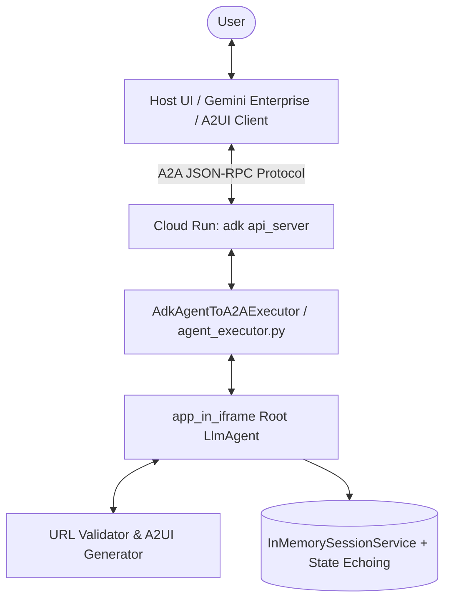
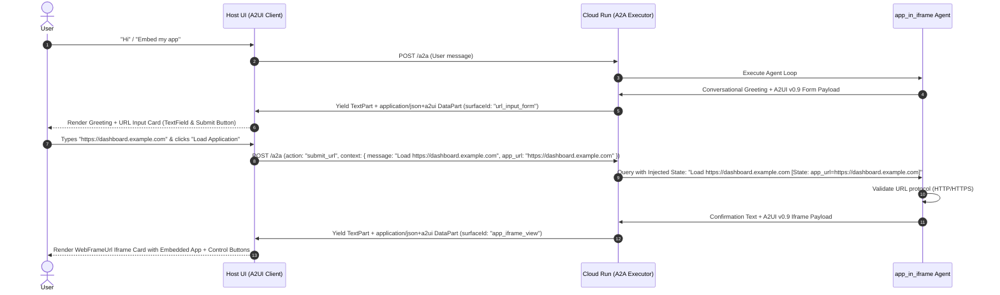
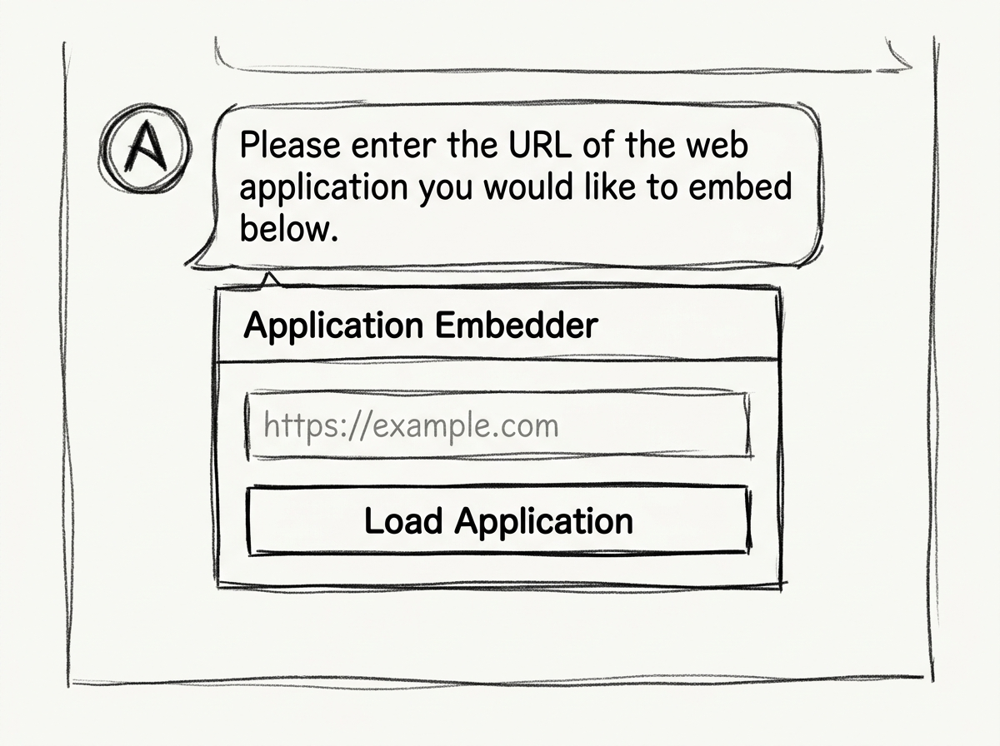
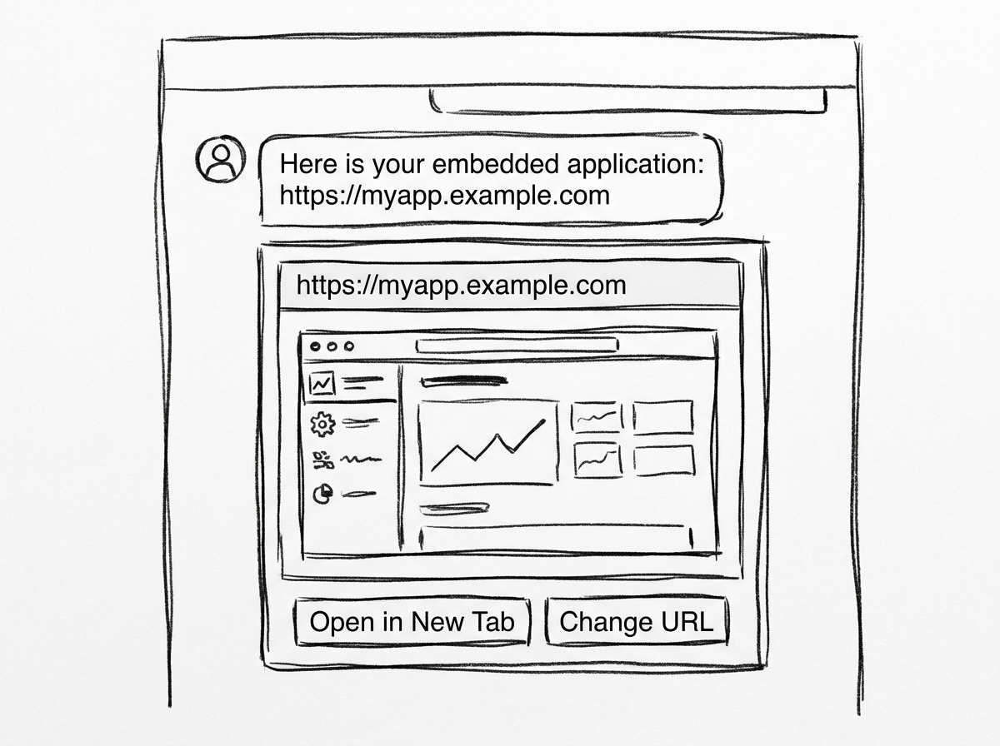

# app_in_iframe A2UI Agent Design Document

## 1. Requirements Analysis
> **Goal**: Clarify what we are building, target user interactions, and constraints.

* **User Problem**: Users need a seamless way to preview, embed, and interact with web applications within a conversational AI agent interface without manually context-switching to external browser tabs.
* **Target Outcome**: An A2UI-compliant agent named `app_in_iframe` that prompts the user with an interactive URL input form (`MaterialInput`), validates that the URL begins with `http://` or `https://`, and mounts an interactive iframe (`IFrameUrl` inside `Canvas`) component directly within the chat surface.
* **Key Constraints & Environment**:
  * **Target Deployment**: Google Cloud Run (`adk api_server` with `--a2a` mode, utilizing custom `AdkAgentToA2AExecutor` stream translation).
  * **A2UI Version Standard**: **A2UI v0.9** (`createSurface`, `updateComponents`, `updateDataModel`, flat component keys, and `action.event` button payloads).
  * **Supported Protocols**: Strict validation for `http://` or `https://` schemes.
  * **Model**: `gemini-2.5-flash` or `gemini-2.5-pro`
  * **Latency & UX**: Instantaneous UI rendering via single-turn conversational forms with transcript echoing for multi-replica session stability.

---

## 2. Architecture Design
> **Goal**: Define the structure, execution flow, component definitions, and state schema.

### 2.1 High-Level Strategy
* **Pattern**: **Single `LlmAgent`** (Simplicity First).
* **Rationale**: The workflow comprises two primary interactive states (URL input and Iframe display). A single LLM agent equipped with structured A2UI prompts/tools can handle state transitions, input validation, and conversational fallbacks without the overhead or latency of a multi-agent swarm.

### 2.2 System Diagram (Logical)



### 2.3 Components

#### **A. Agents**
| Name | Type | Model | Role / Persona |
| :--- | :--- | :--- | :--- |
| `root_agent` | `LlmAgent` | `gemini-2.5-flash` | Application Embedder Assistant. Greet users, request web application URLs via interactive A2UI forms, validate URL protocols, and render sandboxed iframe widgets. |

#### **B. State Schema (`session.state`)**
| Key | Type | Description | Persistence Strategy |
| :--- | :--- | :--- | :--- |
| `app_url` | `str` | Active web application URL to load in the iframe. | In-Memory + Transcript Echoing |
| `last_action` | `str` | Last triggered user action (`submit_url`, `reset_url`). | Session |
| `is_valid` | `bool` | Flag indicating whether the entered URL passed validation. | Session |

#### **C. Tools / Helpers**
| Helper Function | Description | Dependencies |
| :--- | :--- | :--- |
| `validate_url(url: str)` | Validates that the input string starts with `http://` or `https://` and conforms to a standard URL structure. | `urllib.parse` |
| `render_intake_ui()` | Constructs the A2UI v0.9 component JSON for the URL input form (`MaterialInput` + `Canvas`). | Python `json` |
| `render_app_iframe(url: str)` | Constructs the A2UI v0.9 component JSON containing the `IFrameUrl` component inside `Canvas`. | Python `json` |

---

### 2.4 Execution Flow (Sequence)



---

## 3. UX Design & Visual Wireframes

### Step 1: URL Input Form (`surfaceId: "url_input_form"`)



* **Conversational Prompt**: *"Please enter the URL of the web application you would like to embed below."*
* **A2UI v0.9 Components**:
  * **`Card`** (`id: "url_form_card"`): Outer container card providing contrast.
  * **`Column`** (`id: "url_form_col"`, children: `["title_text", "url_field", "submit_btn"]`):
    * **`Text`** (`id: "title_text"`, text: `"Application Embedder"`, usageHint: `"header"`).
    * **`TextField`** (`id: "url_field"`, label: `"Application URL"`, text: `{"path": "/app_url"}`, placeholder: `"https://example.com"`).
    * **`Button`** (`id: "submit_btn"`, child: `"submit_btn_text"`, action: `{"event": {"name": "submit_url", "context": {"message": "Load entered URL", "value": {"path": "/app_url"}}}}`).

#### A2UI v0.9 Schema Definition (Input Form):
```json
{
  "messages": [
    {
      "version": "v0.9",
      "createSurface": {
        "surfaceId": "url_input_form",
        "catalogId": "https://a2ui.org/specification/v0_9/material_catalog.json",
        "theme": { "primaryColor": "#1A73E8" },
        "sendDataModel": true
      }
    },
    {
      "version": "v0.9",
      "updateComponents": {
        "surfaceId": "url_input_form",
        "components": [
          { "id": "root", "component": "Card", "child": "container" },
          { "id": "container", "component": "Column", "children": ["title_text", "url_input", "submit_btn"] },
          { "id": "title_text", "component": "Text", "text": "Application Embedder", "usageHint": "header" },
          { "id": "url_input", "component": "TextField", "label": "Application URL", "text": { "path": "/app_url" }, "placeholder": "https://example.com" },
          { "id": "submit_btn_label", "component": "Text", "text": "Load Application" },
          {
            "id": "submit_btn",
            "component": "Button",
            "child": "submit_btn_label",
            "action": {
              "event": {
                "name": "submit_url",
                "context": {
                  "message": "Load URL from input form",
                  "app_url": { "path": "/app_url" }
                }
              }
            }
          }
        ]
      }
    },
    {
      "version": "v0.9",
      "updateDataModel": {
        "surfaceId": "url_input_form",
        "path": "/",
        "value": { "app_url": "" }
      }
    }
  ]
}
```

---

### Step 2: Embedded Iframe View (`surfaceId: "app_iframe_view"`)



* **Conversational Prompt**: *"Here is your embedded application: https://myapp.example.com"*
* **A2UI v0.9 Components**:
  * **`Card`** (`id: "iframe_card"`): Outer container card.
  * **`Column`** (`id: "iframe_col"`, children: `["url_header", "app_frame", "action_row"]`):
    * **`Text`** (`id: "url_header"`, text: `"Active View: https://myapp.example.com"`).
    * **`WebFrameUrl`** (`id: "app_frame"`, url: `{"literalString": "https://myapp.example.com"}`, height: 500).
    * **`Row`** (`id: "action_row"`, children: `["change_url_btn"]`):
      * **`Button`** (`id: "change_url_btn"`, label: `"Change URL"`, action: `{"event": {"name": "reset_url", "context": {"message": "Enter a different application URL"}}}`).

#### A2UI v0.9 Schema Definition (Iframe View):
```json
{
  "messages": [
    {
      "version": "v0.9",
      "createSurface": {
        "surfaceId": "app_iframe_view",
        "catalogId": "https://a2ui.org/specification/v0_9/material_catalog.json",
        "theme": { "primaryColor": "#1A73E8" },
        "sendDataModel": true
      }
    },
    {
      "version": "v0.9",
      "updateComponents": {
        "surfaceId": "app_iframe_view",
        "components": [
          { "id": "root", "component": "Card", "child": "container" },
          { "id": "container", "component": "Column", "children": ["header_text", "web_frame", "btn_row"] },
          { "id": "header_text", "component": "Text", "text": "Embedded Application: https://myapp.example.com", "usageHint": "header" },
          {
            "id": "web_frame",
            "component": "WebFrameUrl",
            "url": { "literalString": "https://myapp.example.com" },
            "height": 520
          },
          { "id": "btn_row", "component": "Row", "children": ["change_url_btn"] },
          { "id": "change_url_btn_label", "component": "Text", "text": "Change URL" },
          {
            "id": "change_url_btn",
            "component": "Button",
            "child": "change_url_btn_label",
            "action": {
              "event": {
                "name": "reset_url",
                "context": {
                  "message": "Enter another URL"
                }
              }
            }
          }
        ]
      }
    }
  ]
}
```

---

## 4. Evaluation Plan

### 4.1 Strategy
* **Methodology**: Local JSON-RPC execution testing via A2A test client + verification of A2UI `DataPart` payloads (`application/json+a2ui`).
* **Tools**: PyTest, `adk api_server`, and local curl / python A2A client scripts.

### 4.2 Test Scenarios

#### Scenario 1: Standard Happy Path (HTTPS)
* **Input Turn 1**: `"Hello"`
* **Expected Output 1**: Greeting text + `createSurface`/`updateComponents` for `url_input_form`.
* **Input Turn 2**: A2UI Action Event (`name: "submit_url"`, `app_url: "https://cloud.google.com"`).
* **Expected Output 2**: Confirmation text + `createSurface`/`updateComponents` for `app_iframe_view` with `WebFrameUrl` pointing to `https://cloud.google.com`.

#### Scenario 2: Standard Happy Path (HTTP)
* **Input**: A2UI Action Event with `http://localhost:3000` or `http://internal.app`.
* **Expected Output**: Accepted, valid `WebFrameUrl` rendered.

#### Scenario 3: Validation Error (Invalid Scheme / Plain text)
* **Input**: `"ftp://files.example.com"` or `"invalid_url_string"`.
* **Expected Behavior**: Conversational validation warning explaining that only `http://` or `https://` URLs are supported, re-presenting the `url_input_form` with pre-filled or cleared state.

#### Scenario 4: Change / Reset URL Flow
* **Input**: Clicking `"Change URL"` button (`name: "reset_url"`).
* **Expected Behavior**: Agent returns to the URL input form card (`surfaceId: "url_input_form_v2"` or prepends `deleteSurface`).

---

## 5. Development & Deployment Considerations (Cloud Run)

### 5.1 Local & Cloud Run Environment
* **Monkey-Patching**: Use the standard pattern in `agent.py` to hook `AdkAgentToA2AExecutor` onto `google.adk.a2a.executor.a2a_agent_executor.A2aAgentExecutor`.
* **Stream Accumulation**: Accumulate the LLM stream before splitting text from the `---a2ui_JSON---` delimiter, yielding each message in `messages` as a discrete `DataPart` with `mimeType="application/json+a2ui"`.
* **Server Execution**:
  ```bash
  adk api_server . --a2a --allow_origins "*" --port 8080
  ```
* **Dockerfile Structure**:
  ```dockerfile
  FROM python:3.11-slim
  WORKDIR /app
  COPY requirements.txt .
  RUN pip install --no-cache-dir -r requirements.txt
  COPY . .
  ENV PYTHONPATH="/app:$PYTHONPATH"
  EXPOSE 8080
  CMD ["adk", "api_server", ".", "--a2a", "--allow_origins", "*", "--port", "8080", "--host", "0.0.0.0"]
  ```

---

## 6. Review & Approval Checklist
- [x] High-level strategy: Single `LlmAgent` with simplicity-first approach.
- [x] A2UI v0.9 component mapping (`TextField`, `WebFrameUrl`, `Button`).
- [x] HTTP / HTTPS scheme validation logic specified.
- [x] Hand-drawn minimalistic sketch wireframes generated and embedded.
- [x] Target deployment configured for Cloud Run A2A mode.
