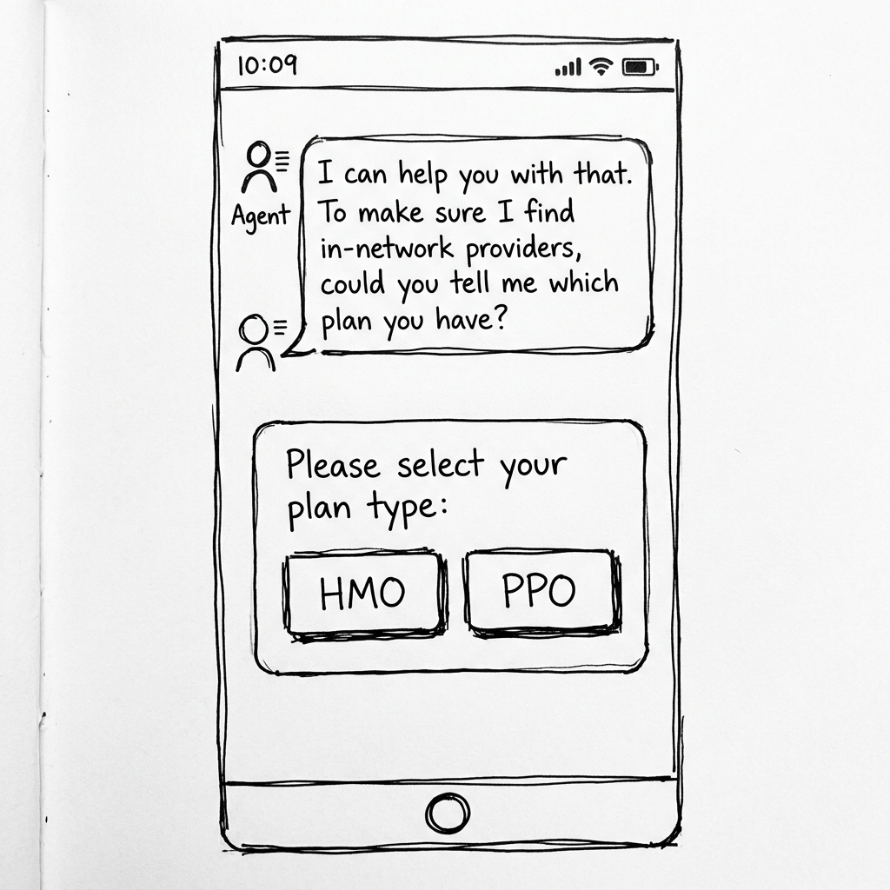
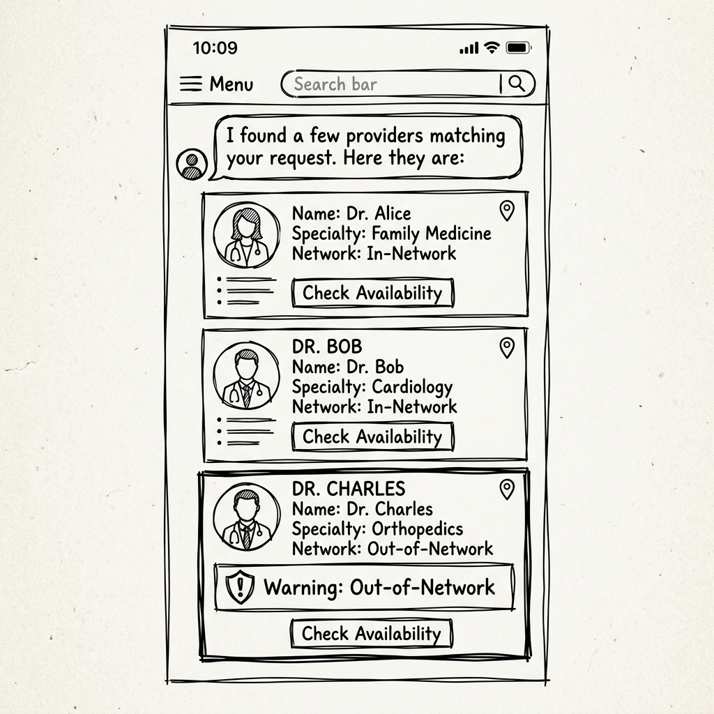
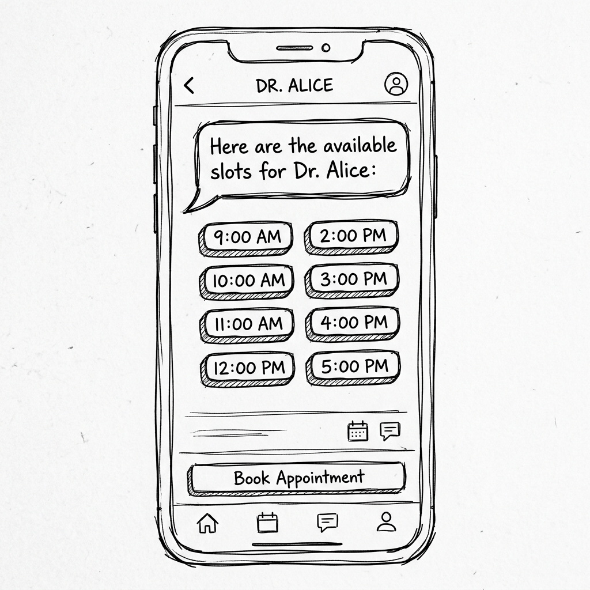
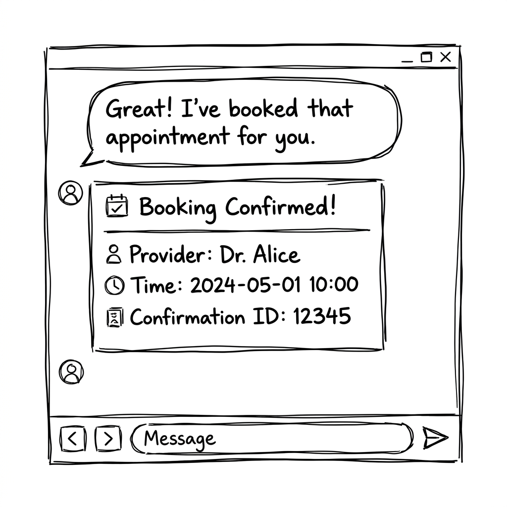

# CareConnect Navigator UX Design

This document outlines the A2UI design for the CareConnect Navigator agent, focusing on provider search, availability checking, and booking.

## Goal
Provide an effortless, plan-aware provider search and instant booking experience with clear Out-of-Network (OON) warnings.

## Flow Breakdown

### Step 1: Initial Request & Plan Clarification (Optional)
**User Intent**: User asks to find a provider but hasn't specified their plan type (HMO/PPO).
**Agent Conversational Response**: "I can help you with that. To make sure I find in-network providers, could you tell me which plan you have?"
**A2UI Components**:
-   `surfaceUpdate` containing a `Card` with:
    -   `Text`: "Please select your plan type:"
    -   `MultipleChoice` or two `Button`s: "HMO", "PPO".

### Step 2: Provider Search Results
**User Intent**: User requests a provider with a specific specialty and location (and plan type is known).
**Agent Conversational Response**: "I found a few providers matching your request. Here they are:"
**A2UI Components**:
-   `surfaceUpdate` containing a `List` of `Card`s.
-   **Each Card** contains:
    -   `Text` (h2): Provider Name
    -   `Text`: Specialty
    -   `Text`: Network Status (In-Network / Out-of-Network)
    -   `Card` (Conditional for OON): "Warning: This provider is Out-of-Network. Higher costs may apply."
    -   `Button`: "Check Availability" (triggers action with `provider_id`).

### Step 3: Availability Selection
**User Intent**: User clicks "Check Availability" for a provider.
**Agent Conversational Response**: "Here are the available slots for [Provider Name]:"
**A2UI Components**:
-   `surfaceUpdate` containing:
    -   `Text`: "Select a time slot:"
    -   `List` or `Row` of `Button`s (or `MultipleChoice` chips) for each available slot.

### Step 4: Booking Confirmation
**User Intent**: User selects a slot to book.
**Agent Conversational Response**: "Great! I've booked that appointment for you."
**A2UI Components**:
-   `surfaceUpdate` containing a success `Card`:
    -   `Text` (h2): "Booking Confirmed!"
    -   `Text`: "Provider: [Provider Name]"
    -   `Text`: "Time: [Selected Slot]"
    -   `Text`: "Confirmation ID: [ID]"

## State/Data Requirements
-   `plan_type`: Stored in session state.
-   `providers`: List of provider objects returned by `search_providers` tool.
-   `slots`: List of available slots returned by `check_availability` tool.
-   `confirmation`: Booking confirmation details returned by `book_appointment` tool.
