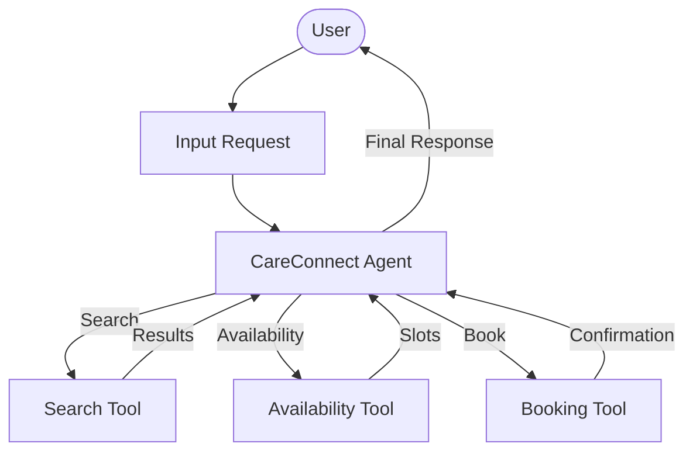
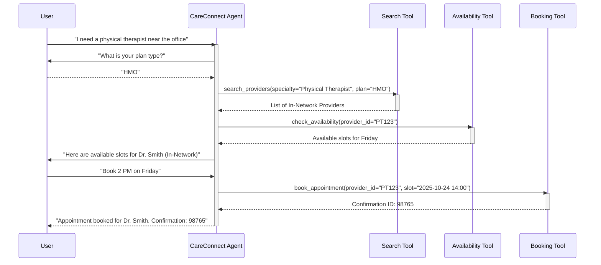

# CareConnect Navigator Design Document

## 1. Requirements Analysis

*   **User Problem**: Finding "in-network" care, checking availability, and booking is cumbersome. Users need transparency between In-Network and Out-of-Network (OON) costs/warnings.
*   **Target Outcome**: Effortless, plan-aware provider search (HMO/PPO) and instant booking with clear OON warnings.
*   **Key Constraints**:
    *   **Plan Types**: Support at least **HMO** and **PPO**. User must be able to choose.
    *   **OON Visibility**: Allow users to choose OON providers but display cost warnings.
    *   **Provider Data Scale**: Mock database must have sufficient density:
        *   At least 3 doctors per specialty.
        *   Both In-Network and OON options for each Zip Code.
        *   Coverage for Greater Atlanta Metro Area (all zip codes).
        *   Include all common specialties (Primary Care, Dermatology, Physical Therapy, Cardiology, etc.).
    *   **Booking API**: Mock Booking API.
    *   **User Profile/Plan Details**: Dynamically retrieved via Agent (Asking the user).
    *   **Plan Rules**: Hardcoded benefits definitions for HMO & PPO plans.

---

## 2. Architecture Design

### 2.1 High-Level Strategy
*   **Pattern**: Single Agent (`LlmAgent`)
*   **Rationale**: A single agent with appropriate tools can handle the multi-step reasoning (identify intent -> search -> check availability -> book) efficiently without the overhead of routing or state tracking between agents, especially given the mock nature of the data sources.

### 2.2 System Diagram (Logical)

### 2.3 Components
#### **A. Agents**
| Name | Type | Model | Role/Persona |
| :--- | :--- | :--- | :--- |
| `careconnect_agent` | `LlmAgent` | `gemini-2.5-flash` | Empathetic healthcare navigator. Helps users find in-network doctors, checks availability, and books appointments. |

#### **B. State Schema (`session.state`)**
| Key | Type | Description | Persistence |
| :--- | :--- | :--- | :--- |
| `plan_type` | `str` | User's insurance plan (HMO or PPO) | Session |
| `selected_provider_id` | `str` | Provider being booked | Session |

#### **C. Tools**
| Tool Function | Description | Dependencies |
| :--- | :--- | :--- |
| `search_providers` | Search providers by specialty, location, and plan_type filter. | SQLite / JSON |
| `check_availability` | Retrieve available time slots for a specific provider ID. | Mock Calendar API |
| `book_appointment` | Confirm booking for a provider ID and time slot. | Mock Booking API |

### 2.4 Execution Flow (Sequence)

---

## 3. Evaluation Plan

### 3.1 Strategy
*   **Methodology**: Comprehensive automated testing using `adk test` (replay JSON sequences) and manual E2E walkthroughs.

### 3.2 Metrics
1.  **Success Rate**: Correctly identify in-network vs out-of-network and apply appropriate warnings.
2.  **Data Validity**: Ensure searches return expected density (checking Atlanta zip codes).
3.  **Error Handling**: Graceful degradation when no slots are available or invalid input is provided.

### 3.3 Test Scenarios

#### **Scenario 1: Happy Path (HMO/PPO in-network booking)**
*   **Input**: "I need a dermatologist near 30303 (Atlanta). I have the PPO plan."
*   **Expected Output**: Agent searches PPO network, lists at least 3 doctors, finds availability, and books successfully.

#### **Scenario 2: Out of Network Warning**
*   **Input**: "Show me all cardiologists, including out-of-network."
*   **Expected Behavior**: Agent lists providers but attaches a clear **Financial Warning** to OON options.

#### **Scenario 3: Unhappy Path (Invalid/No Coverage Area)**
*   **Input**: "I need a specialist in 90210 (Beverly Hills)."
*   **Expected Behavior**: Agent politely informs the user that coverage is limited to Greater Atlanta and offers to help with local options.

#### **Scenario 4: Unhappy Path (No Availability)**
*   **Input**: User selects a provider who has no open slots for the requested day.
*   **Expected Behavior**: Agent detects lack of availability and proactively suggests alternative providers or days.

#### **Scenario 5: Plan Swapping**
*   **Input**: User starts with HMO, then asks "What if I use my spouse's PPO plan?"
*   **Expected Behavior**: Agent updates session state and re-queries filters dynamically.
