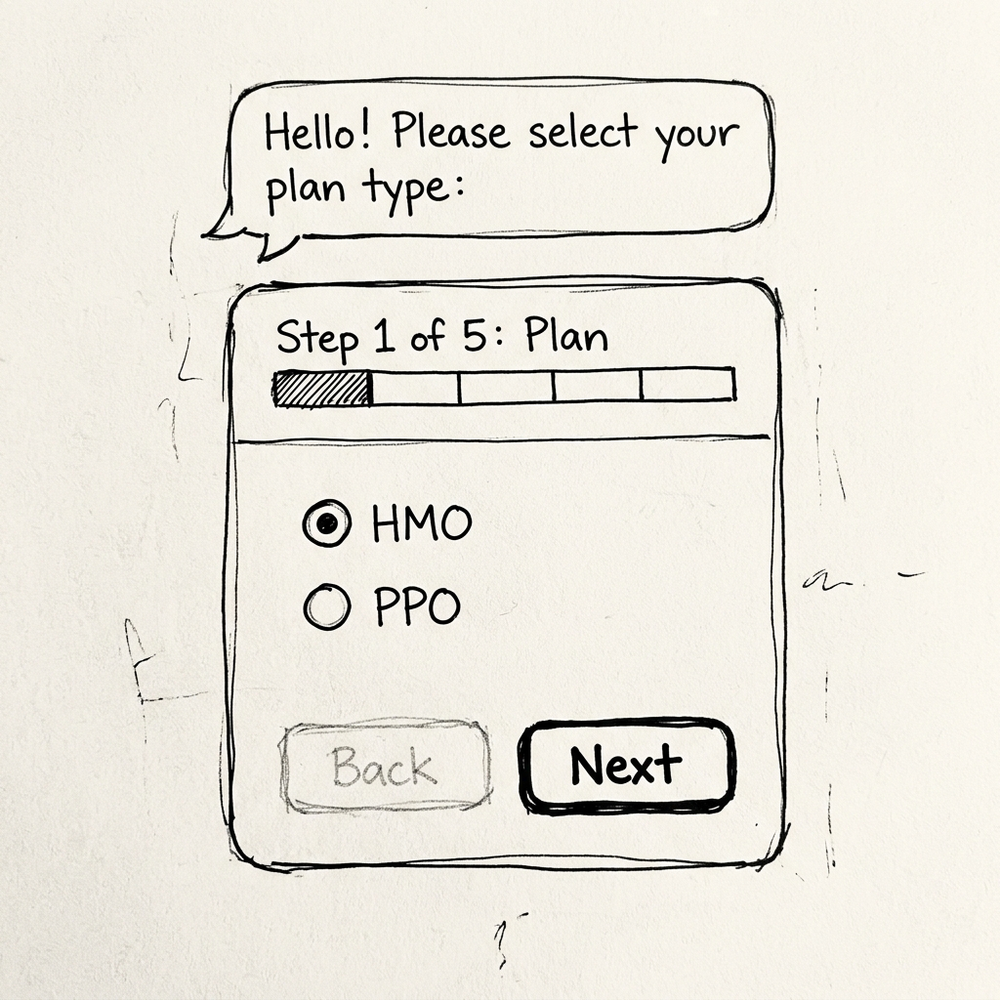
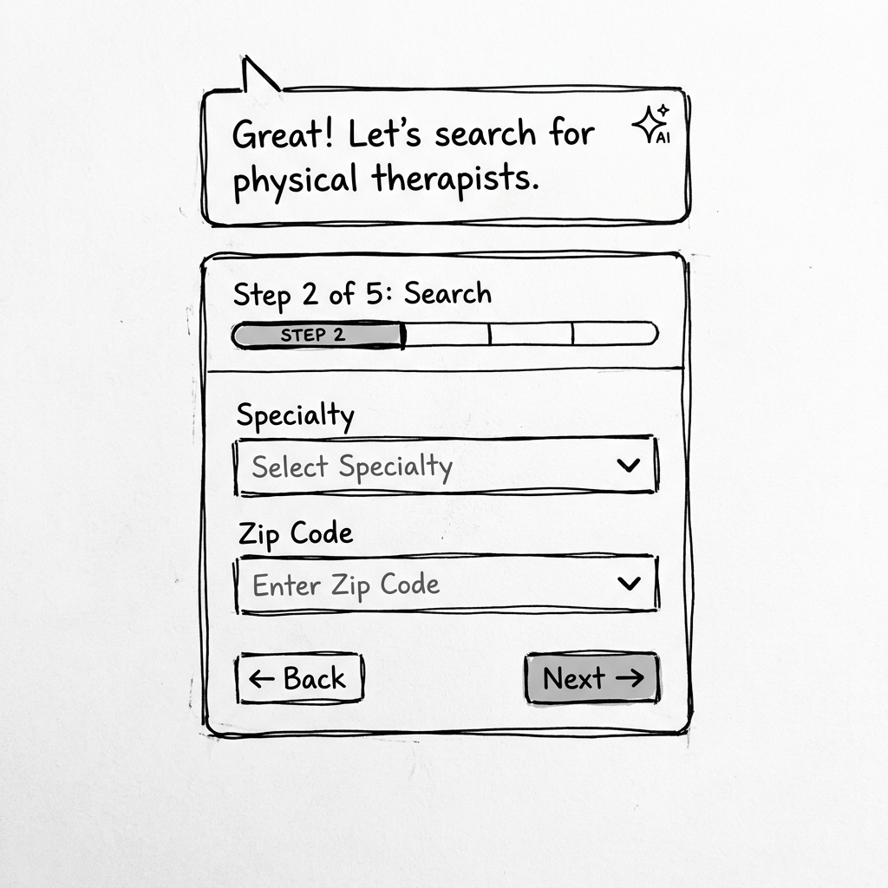
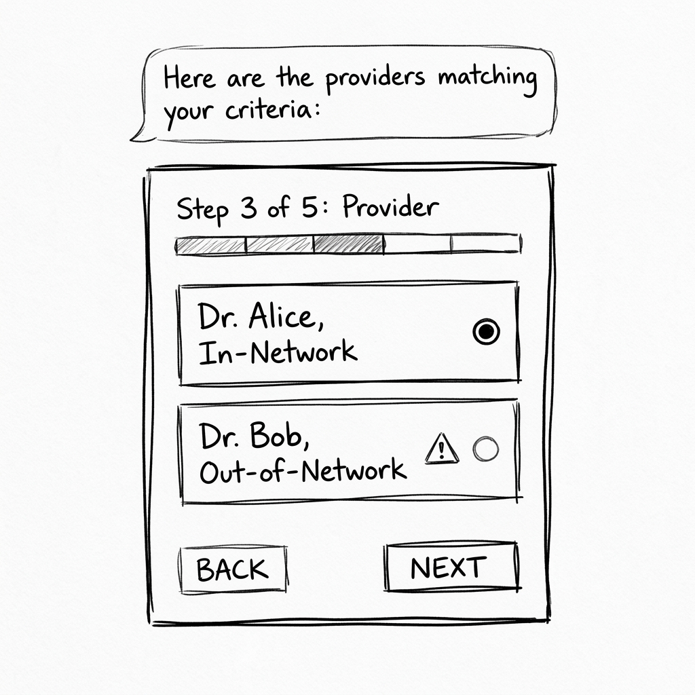
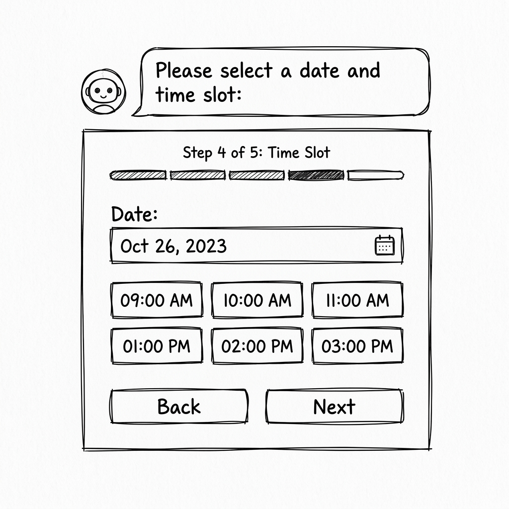
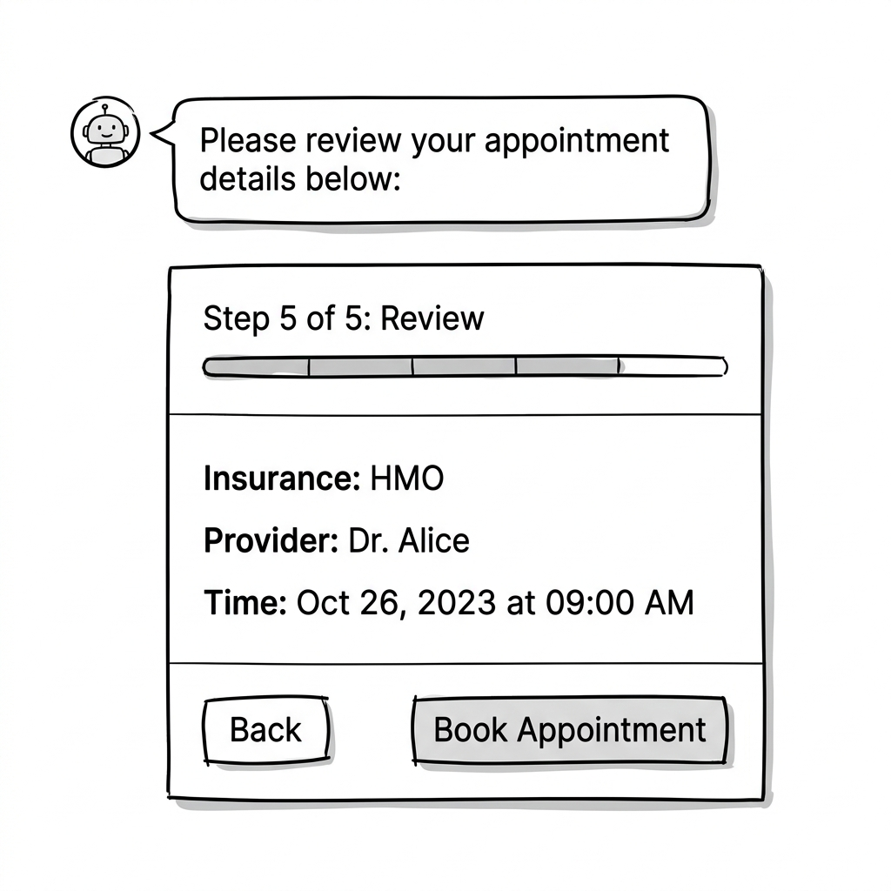
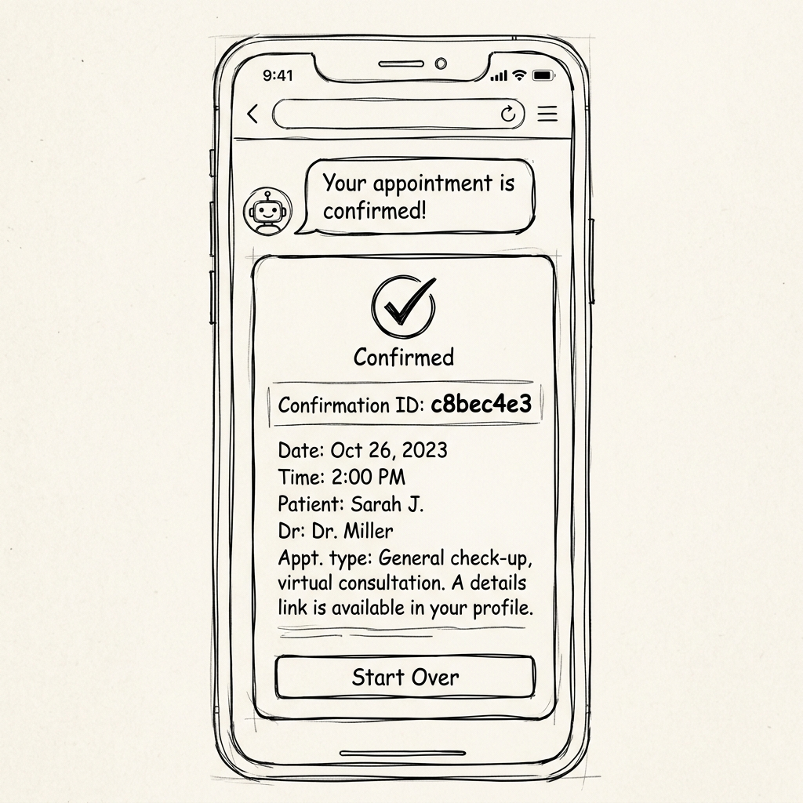

# CareConnect Navigator - Canvas-Based A2UI UX Design

This document outlines the UX design for the `careconnect_navigator` agent, configured to run as a split-pane layout with chat on the left and a single-surface canvas wizard on the right utilizing the A2UI framework.

## Goal
To present the complete appointment booking workflow under a single visual surface (`canvas`) on the right-hand canvas area, while the conversational chat continues on the left-hand pane. This reduces cognitive load, eliminates repetitive typing, and guides the user step-by-step to a final appointment confirmation.

---

## The Split-Screen Layout

```
+------------------------------------------+-------------------------------------------+
|                                          |                                           |
|       GEMINI ENTERPRISE CHAT             |             A2UI CANVAS PANE              |
|             (Left Pane)                  |               (Right Pane)                |
|                                          |                                           |
|  Agent: "Hello! I can help you book...   |  +-------------------------------------+  |
|  Please select your plan type."          |  | Step 1 of 5: Insurance Plan         |  |
|                                          |  |                                     |  |
|  User: [Clicks 'Next' on the right]      |  | (o) HMO      ( ) PPO                |  |
|                                          |  |                                     |  |
|                                          |  |   [Back]                 [Next]     |  |
|                                          |  +-------------------------------------+  |
+------------------------------------------+-------------------------------------------+
```

### Master Component Structure (`canvas` / `root`)
The right-hand canvas renders a persistent surface ID: **`canvas`**.
*   **Header (Stepper / Progress)**: Renders a progressive stepper indicating progress through the 5 steps.
*   **Content Area**: A card showing the specific inputs/outputs for the active step.
*   **Footer Controls**: A standardized row of buttons (`Back` and `Next` / `Book Appointment`) to drive the state transitions.

---

## Detailed Step Breakdown & Material Icons Usage

Material Icons are sourced from the composite catalog: `https://www.gstatic.com/vertexaisearch/a2ui/v0_9/gemini_enterprise_composite_catalog.json`.

### Step 1: Plan Selection
*   **User Intent**: Choose insurance plan type.
*   **Progress Indicator**: Step 1 of 5 [Insurance Plan]
*   **A2UI Components**:
    *   `MaterialIcon` (icon: `health_and_safety`, color: `primary`) next to the section title.
    *   `MaterialText` (Header/Instruction)
    *   `MaterialRadioButton` for Plan Selection (`HMO` or `PPO`).
*   **Footer Actions**:
    *   `Back`: Disabled/Hidden.
    *   `Next` Button (icon: `arrow_forward` or text "Next"): Enabled. Triggers event `next_step` with context `{"current_step": 1, "plan_type": {"path": "/plan_type"}}`.
*   **Wireframe**: 

### Step 2: Search Criteria Selection
*   **User Intent**: Define provider specialty and zip code location.
*   **Progress Indicator**: Step 2 of 5 [Search Criteria]
*   **A2UI Components**:
    *   `MaterialIcon` (icon: `search`, color: `primary`) next to the section title.
    *   `MaterialSelect` (Dropdown) for **Specialty** (Options: Physical Therapy, Dermatology, Cardiology, Pediatrics, Primary Care).
    *   `MaterialSelect` (Dropdown) for **Zip Code** (Options: 30303, 30301, 30305, 30022, 30062).
*   **Footer Actions**:
    *   `Back` Button (icon: `arrow_back` or text "Back"): Enabled. Triggers event `back_step` with context `{"current_step": 2}`.
    *   `Next` Button (icon: `arrow_forward` or text "Next"): Enabled. Triggers event `next_step` with context `{"current_step": 2, "specialty": {"path": "/specialty"}, "zip_code": {"path": "/zip_code"}}`.
*   **Wireframe**: 

### Step 3: Provider Selection
*   **User Intent**: Choose an in-network or out-of-network provider from the search results.
*   **Progress Indicator**: Step 3 of 5 [Select Provider]
*   **A2UI Components**:
    *   `MaterialIcon` (icon: `medical_services`, color: `primary`) next to the section title.
    *   `MaterialColumn` containing a list of `MaterialCard`s.
        *   Each card contains Provider Name, Specialty, and Network Status.
        *   If `Out-of-Network` is selected, a warning banner `MaterialRow` is rendered containing a `MaterialIcon` (icon: `warning`, color: `warn`).
        *   A "Select" button or radio card selection updates the `/selected_provider_id` path.
*   **Footer Actions**:
    *   `Back`: Enabled. Triggers event `back_step` with context `{"current_step": 3}`.
    *   `Next`: Enabled (only once a provider is selected). Triggers event `next_step` with context `{"current_step": 3, "selected_provider_id": {"path": "/selected_provider_id"}}`.
*   **Wireframe**: 

### Step 4: Slot Selection
*   **User Intent**: Choose an appointment date and time slot.
*   **Progress Indicator**: Step 4 of 5 [Appointment Time]
*   **A2UI Components**:
    *   `MaterialIcon` (icon: `event`, color: `primary`) next to the section title.
    *   `MaterialDatepicker` to select the date (binds to `/selected_date`).
    *   `MaterialRow`/`MaterialColumn` grid of available slot `MaterialButton`s (or radio buttons) binded to `/selected_slot`.
*   **Footer Actions**:
    *   `Back`: Enabled. Triggers event `back_step` with context `{"current_step": 4}`.
    *   `Next`: Enabled (only once a slot is selected). Triggers event `next_step` with context `{"current_step": 4, "selected_slot": {"path": "/selected_slot"}}`.
*   **Wireframe**: 

### Step 5: Review & Book
*   **User Intent**: Final summary verification and booking submission.
*   **Progress Indicator**: Step 5 of 5 [Review Details]
*   **A2UI Components**:
    *   `MaterialIcon` (icon: `rate_review`, color: `primary`) next to the section title.
    *   `MaterialCard` showing a complete breakdown:
        *   **Insurance**: PPO
        *   **Provider**: Dr. Alice (In-Network)
        *   **Appointment Time**: 2025-10-24 09:00 AM
*   **Footer Actions**:
    *   `Back`: Enabled. Triggers event `back_step` with context `{"current_step": 5}`.
    *   `Book Appointment` (Submit Button): Triggers final action `book_appointment` with context of all selected values.
*   **Wireframe**: 

### Step 6: Confirmation (Completed)
*   **User Intent**: Review confirmation ID and wrap up.
*   **Progress Indicator**: Completed
*   **A2UI Components**:
    *   `MaterialIcon` (icon: `check_circle`, color: `primary`) showing the success state.
    *   `MaterialCard` with confirmation details.
    *   `MaterialText`: Confirmation ID (`c8bec4e3`).
*   **Footer Actions**:
    *   `Start Over` (Button): Resets the wizard to Step 1.
*   **Wireframe**: 

---

## Data Model State Requirements

The single surface will maintain the following values in its data model:
```json
{
  "plan_type": null,
  "specialty": "Physical Therapy",
  "zip_code": "30303",
  "selected_provider_id": null,
  "selected_date": { "year": 2025, "month": 10, "day": 24 },
  "selected_slot": null,
  "current_step": 1
}
```
