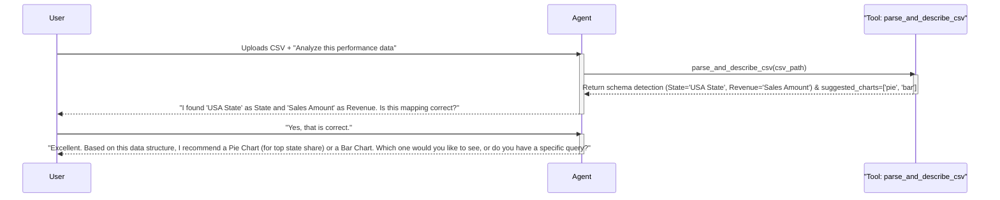
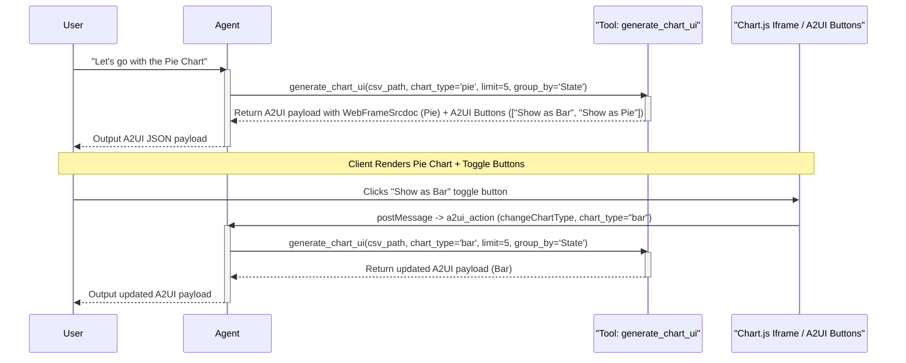

# Company Performance Analyzer Design Document

## 1. Requirements Analysis
> **Goal**: Clarify what we are building and why.

*   **User Problem**: 
    *   The user has annual company performance data across all US states stored in a CSV file.
    *   The CSV format and schema (column names, structure) might not be consistent between different files.
    *   The user wants to analyze this data and view interactive graphical representations using natural language requests (e.g., pie charts for top states, bar graphs, breakdowns by service offerings in each state).
    *   The user needs to be able to modify the charts interactively or ask conversational follow-up questions to drill down.
*   **Target Outcome**: 
    *   An ADK-based agent integrated with Gemini Enterprise using Agent-Driven User Interfaces (A2UI).
    *   The agent dynamically understands the CSV layout, confirms its schema mapping with the user before proceeding, and generates high-fidelity, interactive visualizations rendered inside a sandboxed iframe (`WebFrameSrcdoc`).
*   **Key Constraints**:
    *   **Architecture**: Single Agent (`LlmAgent`) pattern to maintain architectural simplicity.
    *   **UI Delivery**: Use A2UI's standard catalog and `WebFrameSrcdoc` (using `view_type: "AnalyticsChart"`) containing a self-contained HTML page powered by Chart.js.
    *   **Security**: The iframe HTML must enforce Content Security Policy (CSP) with `connect-src 'none'` to be rendered by Gemini Enterprise.
    *   **Interactive Interaction**: Users can click chart elements to trigger drill-downs via `window.parent.postMessage`.
    *   **Recommendation & Controls**: The agent must suggest appropriate chart types based on the characteristics of the uploaded data (e.g. suggesting a pie chart for high-level top-5 state shares, and bar charts for comparing all states). The UI should provide quick-action buttons/options allowing the user to dynamically toggle between the different valid chart types.
*   **Clarification Log**:
    *   *Q: How is the spreadsheet provided?* -> *A: Uploaded as a CSV file in the current session.*
    *   *Q: Is the schema fixed?* -> *A: No, column names may vary. The agent must parse the headers, infer their meaning (e.g., matching 'State', 'Province', or 'Region' to States), and confirm its mapping with the user first.*
    *   *Q: What chart types are required?* -> *A: Pie charts, bar graphs, and breakdowns. These will be generated using a dynamic Chart.js template inside `WebFrameSrcdoc`.*
    *   *Q: Do we need multi-turn history?* -> *A: Yes, the user must be able to ask follow-up questions to filter or change chart types (e.g., "now show it as a bar graph").*
    *   *Q: Can the system suggest chart options?* -> *A: Yes, the agent will analyze data shape and cardinality to suggest the best formats, and provide options/buttons to toggle between them.*

---

## 2. Architecture Design
> **Goal**: Define the structure (Agents, Tools, Flow).

### 2.1 High-Level Strategy
*   **Pattern**: Single Agent (`LlmAgent`) pattern.
*   **Rationale**: The entire business logic (parsing CSV, confirming schema, generating chart payloads, and refining outputs) can be performed by a single agent equipped with targeted Python tools. Using a multi-agent swarm would introduce unnecessary latency and state-sync complexity.

### 2.2 System Diagram (Logical)
```mermaid
graph TD
    User([User]) -->|1. Uploads CSV| Agent[Performance Analyzer Agent]
    Agent -->|2. Inspect CSV| Tool1[parse_and_describe_csv]
    Tool1 -->|3. Inferred Schema| Agent
    Agent -->|4. Ask User to Confirm Schema| User
    User -->|5. Confirms Schema| Agent
    Agent -->|6. Suggest Appropriate Charts & Ask User to Select| User
    User -->|7. Selects Chart or Asks Query| Agent
    Agent -->|8. Summarize & Aggregate Data| Tool2[generate_chart_ui]
    Tool2 -->|9. Return A2UI WebFrameSrcdoc Payload with Toggle Buttons| Agent
    Agent -->|10. Render Interactive Chart & Switch Buttons| User
    User -->|11. Interact (Click Slice/Bar or Toggle Button)| ChartJS[Chart.js Iframe / A2UI Buttons]
    ChartJS -->|12. postMessage or Button Submit: a2ui_action| HostContext[A2UI Host Platform]
    HostContext -->|13. Send Event Session State| Agent
```

### 2.3 Components

#### **A. Agents**
| Name | Type | Model | Role/Persona |
| :--- | :--- | :--- | :--- |
| `PerformanceAnalyzer` | `LlmAgent` | `gemini-2.5-flash` | An expert data analyst capable of parsing arbitrary CSV files, confirming structure with users, and generating interactive charts using A2UI payloads. |

#### **B. State Schema (`session.state`)**
| Key | Type | Description | Persistence |
| :--- | :--- | :--- | :--- |
| `csv_file_path` | `str` | File path of the uploaded CSV on disk | Session |
| `schema_mapping` | `dict` | Inferred mapping of columns (e.g., `{"state_col": "Region", "revenue_col": "Sales 2025", "offering_col": "Product Line"}`) | Session |
| `schema_confirmed` | `bool` | True if the user has confirmed the mapping | Session |
| `suggested_chart_types` | `list` | List of recommended chart type strings (e.g., `["pie", "bar"]`) inferred from the data properties | Session |
| `current_chart_type` | `str` | Type of chart currently rendered (e.g., `pie`, `bar`) | Session |
| `current_aggregation` | `dict` | The last query parameters used to slice the data | Session |

#### **C. Tools**
| Tool Function | Description | Dependencies |
| :--- | :--- | :--- |
| `parse_and_describe_csv` | Parses the uploaded CSV file header and first 5 rows. Infers State, Revenue, and Offering columns. Evaluates data characteristics (e.g. unique values, scale) to recommend 2-3 appropriate chart types. Returns a JSON summary. | `pandas` |
| `generate_chart_ui` | Reads the CSV file, filters/aggregates data based on requested parameters, constructs the A2UI message payload enclosing `WebFrameSrcdoc` along with interactive A2UI toggle buttons for suggested chart types. | `pandas`, `jinja2` |

---

### 2.4 Execution Flow (Sequence)

#### **Flow 1: CSV Upload & Schema Confirmation (One-Time)**


#### **Flow 2: Initial Chart Generation & Multi-turn Toggle (Repeatable)**


---

## 3. Evaluation Plan
> **Goal**: Define how we verify success.

### 3.1 Strategy
*   **Methodology**: 
    *   **Unit Tests**: Test the CSV parsing tool with diverse/inconsistent column headers to ensure robust mapping heuristics.
    *   **Integration Tests**: Run the agent end-to-end using `adk run` replay scripts to simulate turns (file upload -> schema confirmation -> initial chart -> follow-up request).
    *   **Visual/Interactive Verification**: Verify that the generated Chart.js script is valid, correctly formats datasets, handles empty data gracefully, and correctly posts events back to the parent window.

### 3.2 Metrics
1.  **Schema Identification Accuracy**: 100% detection of State, Revenue, and Offering columns across 5 distinct test spreadsheets with varying headers.
2.  **A2UI Validation Rate**: 100% of generated JSON messages must pass the A2UI v0.8 schema validation.
3.  **Interaction Latency**: Agent execution time per turn should be under 3 seconds using `gemini-2.5-flash`.

### 3.3 Test Scenarios

#### **Scenario 1: Schema Inconsistency Resolution (Happy Path)**
*   **Input Spreadsheet**: Header `[Region, Product Line, Sales_USD]`.
*   **Agent Prompt**: "Analyze this spreadsheet."
*   **Expected Output**: Agent asks if `Region` maps to State, `Product Line` to Offering, and `Sales_USD` to Revenue.

#### **Scenario 2: Generating Top 5 States Pie Chart**
*   **Input**: User confirms schema and asks: "Show me the data for top five states and the rest in a pie chart."
*   **Expected Behavior**: Pie chart renders with 6 slices (5 highest revenue states + 1 "Other" slice containing the sum of the remaining states).

#### **Scenario 3: Conversational Follow-up (Switching Chart Type)**
*   **Input**: User asks: "Now show this as a bar graph."
*   **Expected Behavior**: The view updates to show the exact same aggregated data in a Bar Chart layout.

#### **Scenario 4: Drill Down Interaction (WebFrame Action)**
*   **Input Action Event**: User clicks a bar corresponding to a State.
*   **Expected Behavior**: Agent triggers a drill-down, showing a breakdown of service offerings for that specific state.

---

## 4. Development & Testing Considerations
> **Goal**: Document environment-specific behaviors and setup.

### 4.1 Iframe Script Details (`WebFrameSrcdoc`)
To render interactive charts dynamically, the HTML source code template generated by `generate_chart_ui` will look like:
```html
<!DOCTYPE html>
<html>
<head>
  <meta http-equiv="Content-Security-Policy" content="connect-src 'none'">
  <script src="https://cdn.jsdelivr.net/npm/chart.js"></script>
  <style>
    body { font-family: sans-serif; margin: 0; padding: 10px; background-color: #f9f9f9; }
    #container { max-width: 600px; margin: auto; height: 380px; }
  </style>
</head>
<body>
  <div id="container">
    <canvas id="myChart"></canvas>
  </div>
  <script>
    const ctx = document.getElementById('myChart').getContext('2d');
    const chartData = {{ CHART_DATA_JSON }}; // Injected by Python Tool
    const chartType = '{{ CHART_TYPE }}';    // Injected by Python Tool
    
    const myChart = new Chart(ctx, {
      type: chartType,
      data: chartData,
      options: {
        responsive: true,
        maintainAspectRatio: false,
        onClick: (evt, activeElements) => {
          if (activeElements.length > 0) {
            const index = activeElements[0].index;
            const label = myChart.data.labels[index];
            const value = myChart.data.datasets[0].data[index];
            
            // Post action back to Gemini A2UI host
            window.parent.postMessage({
              type: 'a2ui_action',
              action: 'drillDown',
              data: { label: label, value: value }
            }, '*');
          }
        }
      }
    });
  </script>
</body>
</html>
```

### 4.2 State Update via Action Events
*   When a user clicks on the chart, the host intercepts the `postMessage` and updates the agent's turn.
*   The action data (`{"label": "California", "value": 50000}`) is passed into the session context.
*   The agent instructions must instruct the LLM to inspect session context for `action` and `data` updates and call `generate_chart_ui` to render the drill-down view.
