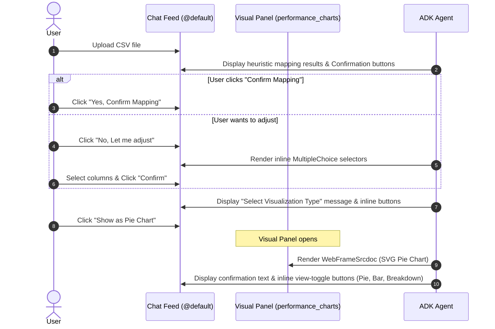

# UX Design Document: Conversational-First Column Mapping & Split Chart Surface

This document outlines the redesigned UX flow for the **Company Performance Analyzer** agent. The design focuses on a **Conversational-First** approach: keeping interactive form inputs, dropdowns, and selector buttons inline within the chat conversation feed, while reserving the right-side visual panel exclusively for rendering the rich SVG chart layouts.

---

## 1. Interaction Flow

The interaction sequence consists of 3 distinct conversational turns:

---

## 2. Component Design Details

### A. Turn 1: Schema Mapping (Conversational Chat Feed)
Upon spreadsheet upload, the agent prints its heuristic mappings in natural text and presents inline quick-action buttons on the `@default` surface:
1.  **Confirmation Options (Row)**:
    -   `Yes, Confirm Mapping` button: Triggers `confirmSchema` action with matched defaults.
    -   `No, Let me adjust` button: Triggers `requestManualMapping` action.
2.  **Manual Mapping Form (Column - Conditional)**:
    -   If the user selects manual adjustment, inline `MultipleChoice` dropdowns for `State`, `Revenue`, and `Offering` are rendered directly in the conversation flow, followed by a `Confirm Mapping` button.

### B. Turn 2: Chart Selector (Conversational Chat Feed)
Once the schema is confirmed, the agent displays the visualization options as inline buttons in the chat feed to preserve context:
*   `Show as Pie Chart` button: Triggers `changeChartType` with `chart_type = "pie"`.
*   `Show as Bar Chart` button: Triggers `changeChartType` with `chart_type = "bar"`.
*   `Show as Service Breakdown` button: Triggers `changeChartType` with `chart_type = "grouped_bar"`.

### C. Turn 3: Visual Chart Panel (WebFrameSrcdoc)
 Reserving the right-side panel (`performance_charts`) exclusively for the dashboard visualizer ensures there is no layout collision.
*   **WebFrameSrcdoc**:
    -   Renders a lightweight, responsive CSS/SVG rendering of the selected chart.
    -   To ensure maximum security compatibility and prevent sandboxing blockages in strict production systems, the HTML iframe contains **no inline JavaScript `<script>` tags** and relies purely on CSS transitions/hover titles.
    -   Height is set to a comfortable `400px` to prevent layout clipping.
*   **Conversational View Toggles**:
    -   Alongside rendering the chart, the agent outputs inline quick-action buttons in the chat feed to allow the user to easily switch visualization types (Pie, Bar, Breakdown) without cluttering the chart frame.
