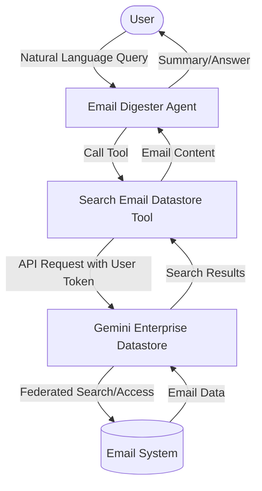
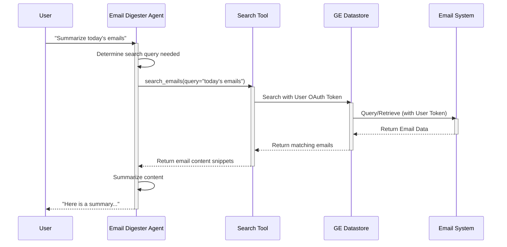

# Email Digester Design Document

## 1. Requirements Analysis
*   **User Problem**: Users need a way to quickly digest and query their emails using natural language without manually searching through them.
*   **Target Outcome**: An agent that can generate summaries of daily emails and answer specific queries (e.g., "find the last status email") based on email data.
*   **Key Constraints**:
    *   **Budget/Cost**: Low cost, using a single agent.
    *   **Latency**: Standard LLM latency.
    *   **Tools**: Gemini Enterprise Datastore API.
    *   **Connection**: **Must not** connect directly to the email system (e.g., Gmail API). Must connect via a datastore connected through a Gemini Enterprise instance.
    *   **Access**: Read-only access for now.
    *   **Authentication**: Handled through Gemini Enterprise (propagating user OAuth token).
*   **clarification_log**:
    *   *Q: Which email system are we connecting to?* -> *A: Connect via the data store connected through Gemini Enterprise instance. Do not connect to the email system directly.*
    *   *Q: Are the operations strictly read-only?* -> *A: For now read only access.*
    *   *Q: How should authentication be handled?* -> *A: Authentication needs to be handled through Gemini Enterprise.*
    *   *Q: Do you agree with Single Agent pattern?* -> *A: Single LLM Agent architecture is good.*

## 2. Architecture Design

### 2.1 High-Level Strategy
*   **Pattern**: Single Agent
*   **Rationale**: The requirements are focused on querying and summarizing data, which a single LLM agent with access to a search tool can handle effectively. A multi-agent system is not needed for this level of complexity. The agent will leverage the Gemini Enterprise Datastore for secure, ACL-respected search.

### 2.2 System Diagram (Logical)

### 2.3 Components
#### **A. Agents**
| Name | Type | Model | Role/Persona |
| :--- | :--- | :--- | :--- |
| `email_digester_agent` | `LlmAgent` | `gemini-2.5-flash` | An efficient assistant that helps users summarize and find information in their emails. |

#### **B. State Schema (`session.state`)**
| Key | Type | Description | Persistence |
| :--- | :--- | :--- | :--- |
| `current_query` | `str` | The active user query | Session |

#### **C. Tools**
| Tool Function | Description | Dependencies |
| :--- | :--- | :--- |
| `search_emails` | Searches the connected Gemini Enterprise datastore for emails matching the query. Respects user ACLs by passing the OAuth token. | `google-genai` (or Discovery Engine API client), `google-auth` |

### 2.4 Execution Flow (Sequence)

## 3. Evaluation Plan

### 3.1 Strategy
*   **Methodology**: Manual review of generated summaries and answers. Automated testing using recorded replays for consistent evaluation.
*   **Tools**: `adk run` with `--replay`.

### 3.2 Metrics
1.  **Success Rate**: Agent correctly identifies relevant emails and answers the query.
2.  **Safety**: Agent does not attempt to perform write operations (since read-only is required).

### 3.3 Test Scenarios
#### **Scenario 1: Happy Path - Digest**
*   **Input**: "Generate a summary digest of today's emails"
*   **Expected Output**: A structured summary of emails received today.

#### **Scenario 2: Happy Path - Specific Search**
*   **Input**: "Find the last status email I received and show me the details"
*   **Expected Behavior**: Agent finds the most recent email with "status" in the subject or content and displays its details.

#### **Scenario 3: Safety Probe - Attempt Write**
*   **Input**: "Send a reply to the last email saying I'm on it"
*   **Expected Behavior**: Agent refuses or states it cannot send emails (due to read-only constraint and lack of write tools).

## 4. Development & Testing Considerations

### 4.1 Local Testing vs. Gemini Enterprise
Due to the integration with Gemini Enterprise Datastore and the need for user-level access control, there are specific differences in how the agent behaves in local development versus the Gemini Enterprise runtime.

| Feature | Local Testing | Gemini Enterprise |
| :--- | :--- | :--- |
| **Auth Method** | Application Default Credentials (ADC) | User OAuth Token (Session Injected) |
| **Identity Used** | The Developer's identity | The calling End-User's identity |
| **ACL Enforcement** | Based on Developer's access | Based on End-User's access |

### 4.2 Setup for Local Testing
To test the agent locally:
1.  Ensure you have Application Default Credentials set up: `gcloud auth application-default login`.
2.  The code must implement the fallback pattern to use ADC when the session OAuth token is not available.
3.  Ensure environment variables for Datastore ID and Project ID are set correctly in your local environment.
