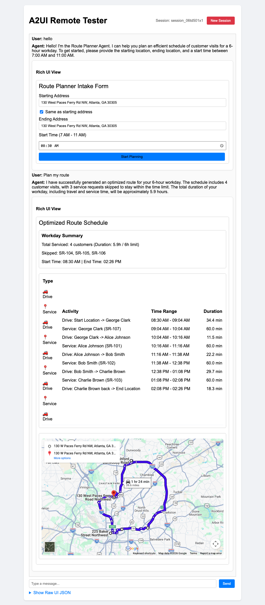

# The Future of Field Service.

Every day, thousands of enterprises face a silent, costly drain on their operations. Their field service representatives—the people who keep customers happy and systems running—spend the first hour of their morning doing something they shouldn't have to do: trying to play dispatcher. They compare service requests, guess travel times, manually map sequences of customer addresses, and try to construct a route that fits within their workday. It is a slow, stressful daily ritual that results in missed service requests, wasted fuel, and frustrated representatives. 

For the enterprise, this means lost productivity, rising operational overhead, and delayed customer service. We shouldn't have to manage service requests this way.

Today, we are changing this forever.

What if your field service representatives could start their day with a perfectly optimized schedule, built automatically around their daily service requests in a single click?

Today, we are introducing the **A2UI Route Planner Agent**. A breakthrough AI Agentic solution built specifically for enterprises to empower their mobile workforces.

### Direct from the Browser: Verified E2E Execution

The Route Planner Agent has been fully verified end-to-end in browser testing:

### The Daily Dispatch, Automated

The Route Planner Agent takes the complex, daily puzzle of service request scheduling and makes it completely effortless. We designed it so your representatives can focus on servicing customers, not solving maps.

Here is how it works:
*   **They just enter their workday start details.** The representative inputs their starting address, ending address, and desired start time.
*   **The agent orchestrates the day.** It automatically fetches the daily assigned service requests, queries real-time traffic details, and computes the optimal sequence of visits that fits within a standard 6-hour limit.
*   **They just drive and service.** A beautiful interactive timeline dashboard appears instantly alongside a live directions map. Representatives see exactly when they will arrive, what request they are servicing, and the best driving path.

### The Enterprise Value

This isn't just a mapping tool. This is a business transformation. By automating the planning of daily service requests, the Route Planner Agent gives your representatives their mornings back. For an enterprise, this translates to:
*   **Maximizing Service Capacity**: Reps can complete more service requests per day with zero wasted travel time.
*   **Reducing Operational Overhead**: Shorter, optimized driving paths mean lower fuel costs and less wear on company fleets.
*   **Exceeding Customer SLAs**: Reliable, traffic-aware schedules ensure service reps arrive precisely when expected, driving customer satisfaction and retention.

### A Glimpse of the Future

This is the beginning of a fundamental shift in how enterprises orchestrate mobile operations. We are moving away from manual coordinate lists and static maps. We are entering the era of intelligent, agentic partners that seamlessly connect dispatch data, real-time geography, and representative workflows. 

The Route Planner Agent is available for enterprise licensing starting today.

**Equip your field service teams with the future of scheduling today.**

Empower your workforce. Delight your customers. Streamline your operations.
