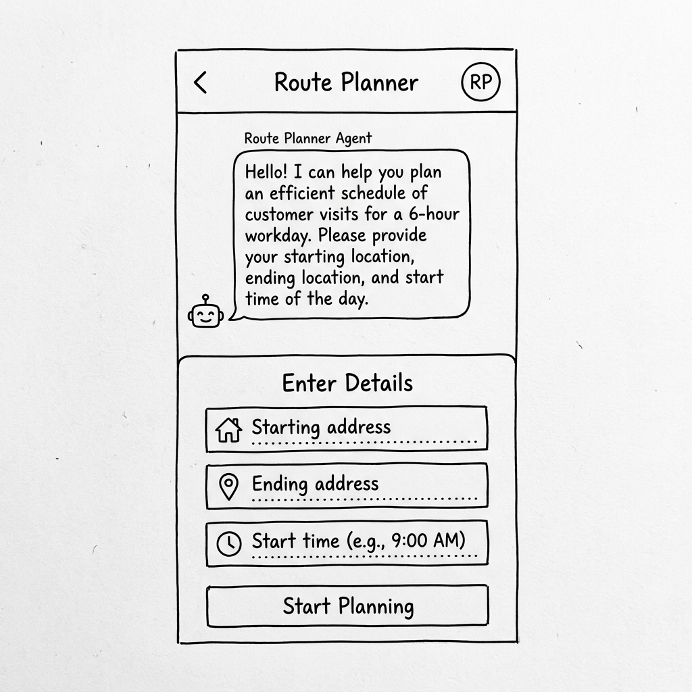
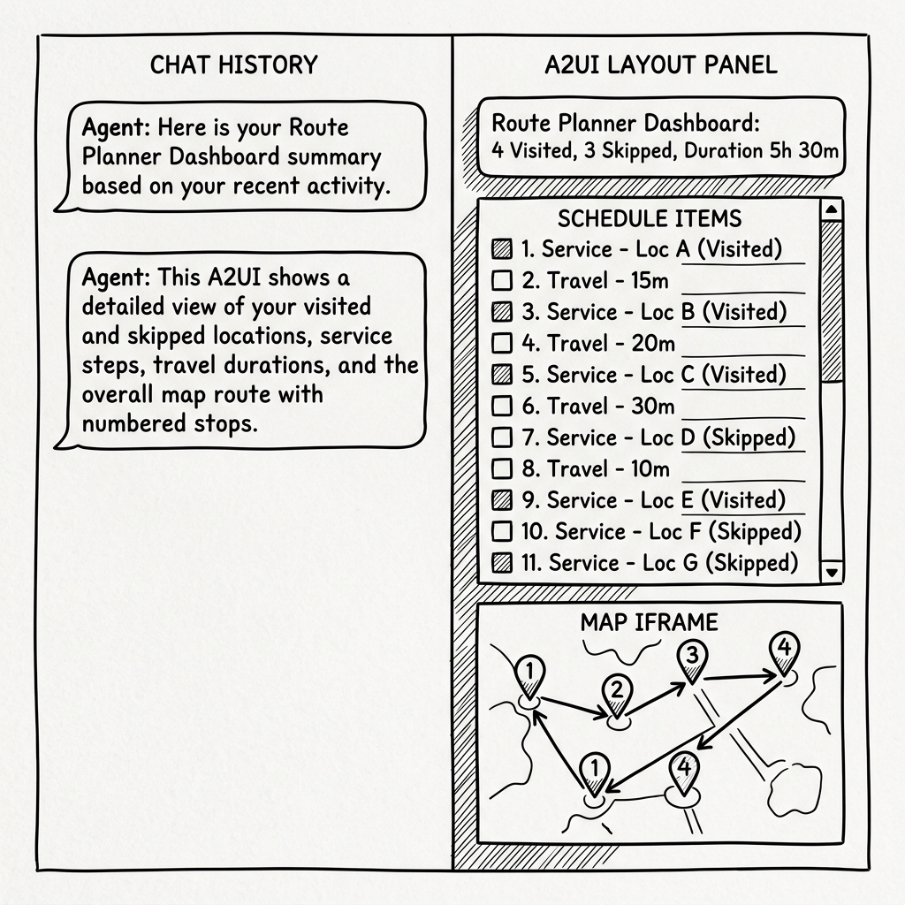

# UX Design Document: Route Planner Agent with A2UI

This document details the user experience (UX) design for the **Route Planner Agent** integrated with Gemini Enterprise using Agent-Driven User Interfaces (A2UI) and an embedded Google Maps iframe.

## Goal
To provide field service representatives with a visual, interactive dashboard within Gemini Enterprise that summarizes their optimized 6-hour workday schedule and shows the route map on Google Maps.

---

## 1. Interaction Flow Breakdown

### Step 1: Initial Greeting and Intake
*   **User Intent**: Initiates a conversation to plan a workday route.
*   **Agent Conversational Response**:
    > "Hello! I am the Route Planner Agent. I can help you design an optimized customer visit schedule for your 6-hour workday. Please provide your starting and ending addresses, along with your start time (between 7:00 AM and 11:00 AM)."
*   **A2UI UI Components**:
    *   `Card` enclosing:
        *   `Text` prompt to enter details.
        *   `TextField` for **Starting Address**.
        *   `CheckBox` for **Same as starting address** (linked to `same_as_start` state).
        *   `TextField` for **Ending Address**.
        *   `DateTimeInput` for **Start Time** (configured with `enableDate: false`, `enableTime: true`, `min: "07:00"`, `max: "11:00"` to validate that the start time is strictly between 7 AM and 11 AM).
        *   `Button` labeled "Start Planning" (triggers action `submit_trip_details`).

#### Greeting Wireframe


---

### Step 2: Route Optimization and Dashboard Rendering
*   **User Intent**: Submits the trip details.
*   **Agent Conversational Response**:
    > "I've fetched your assigned customer service requests for today and calculated the optimal route. Here is your Route Planner Dashboard with your schedule and mapped directions."
*   **A2UI UI Components**:
    *   **Layout**: Vertical `Column` container.
    *   **Summary Card**: Displays high-level stats:
        *   Total customers visited (e.g., 4) vs skipped (e.g., 3).
        *   Total duration (e.g., 5h 30m).
    *   **Timeline (Column)**: A list of `Card` components, each representing a segment in chronological order:
        *   **Travel Card**: Displays a car icon, driving duration, and route segment (e.g., "Drive from Start Location to Stop 1").
        *   **Service Card**: Displays a checkmark/visit icon, customer name, request ID, start time, and end time (e.g., "Service: Fiona Gallagher (SR-106) | 9:13 AM - 10:13 AM").
    *   **Google Maps WebFrame**: An embedded iframe component displaying the route directions.

#### Dashboard & Route Map Wireframe


---

## 2. Iframe Component Design (Google Maps)

To render the route maps in an iframe within Gemini Enterprise, we will use the **`WebFrameUrl`** component from the custom Gemini Enterprise catalog.

### Selected Design: `WebFrameUrl` (Option A)
*   **Why**: Google Maps requires external network access to load dynamic map tiles and routing scripts. Since `WebFrameUrl` permits outbound network requests (for allowlisted domains), this is the optimal component.
*   **A2UI JSON Spec**:
    ```json
    {
      "id": "route_map_iframe",
      "component": "WebFrameUrl",
      "url": {
        "literalString": "https://www.google.com/maps/embed/v1/directions?key=API_KEY&origin=START_ADDRESS&destination=END_ADDRESS&waypoints=WAYPOINT_1|WAYPOINT_2"
      },
      "height": 450
    }
    ```
*   **Dynamic Construction**: The agent's Python tool `optimize_route` outputs the chronological list of coordinates. The agent then formats the `WebFrameUrl` payload, encoding the origin, destination, and waypoints as URL parameters for the Google Maps Embed API.

### Discarded Design: `WebFrameSrcdoc` (Option B)
*   **Reason for Discarding**: `WebFrameSrcdoc` enforces a strict CSP (`connect-src 'none'`), which prevents loading dynamic script elements and tile image resources from external Google Maps API domains directly inside the frame.


---

## 3. State & Data Exchange Requirements

To successfully drive the A2UI and the Maps iframe, the agent maintains the following variables in its session state:

| Field | Source / Tool Output | Purpose in UI |
| :--- | :--- | :--- |
| `start_location` | User Input (`submit_trip_details`) | Origin parameter in Google Maps Embed API |
| `end_location` | User Input (`submit_trip_details`) | Destination parameter in Google Maps Embed API |
| `start_time` | User Input (`submit_trip_details`) | Baseline for timeline start |
| `timeline` | `optimize_route()` output | Populates the list of Travel and Service Cards |
| `skipped_requests` | `optimize_route()` output | Listed in the dashboard summary card |
| `maps_api_key` | Environment Variable (`.env`) | Auth credential in Google Maps Embed URL |
| `waypoints` | Calculated in Python from timeline | Waypoint list parameter in Google Maps Embed URL |
