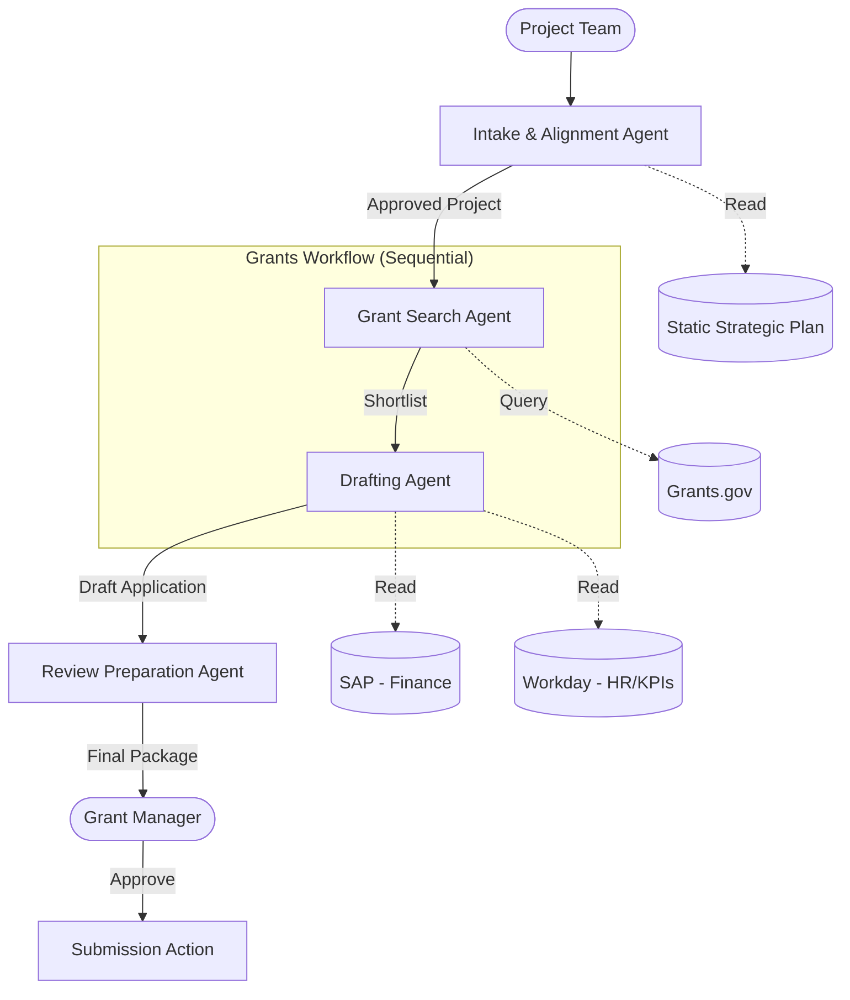
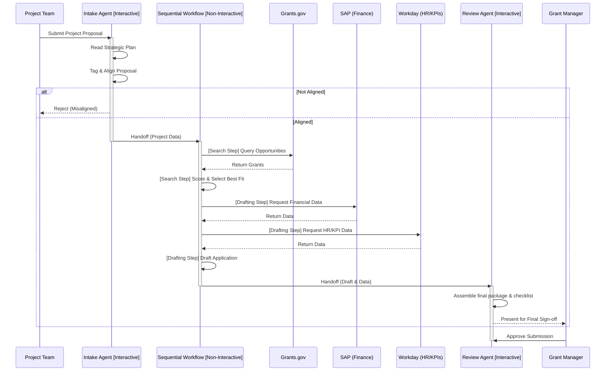

# Automated Grants and Funding Manager Design Document

## 1. Requirements Analysis
> **Goal**: Clarify what we are building and why.

*   **User Problem**: The grant acquisition process is currently manual, time-consuming, and lacks a systematic way to ensure projects align with agency strategy before investing effort in applications.
*   **Target Outcome**: An automated system that handles goal intake, strategic alignment, grant searching, high-confidence scoring, drafting, and submission preparation, significantly reducing the "time to submission" and increasing the success rate.
*   **Key Constraints**:
    *   **Cost/Latency**: Needs to process potentially large documents (strategic plans, financial data) efficiently.
    *   **Tools**: Requires integrations with internal systems (HR, Finance, Program Management) and external grant databases.
    *   **Security/Privacy**: Must securely handle sensitive internal financial and programmatic data.
*   **clarification_log**:
    *   *Q: What specific external grant databases need to be integrated? (e.g., Grants.gov, specialized foundation databases)* -> *A: Grants.gov*
    *   *Q: What are the primary internal systems for HR and Finance? (e.g., Workday, SAP)* -> *A: Workday and SAP*
    *   *Q: Who will be using this system? (e.g., Project Managers for intake, Grants Managers for final review)* -> *A: Grant Managers*
    *   *Q: Is the "agency strategic plan" a static document, or a dynamic database?* -> *A: Static document*

---

## 2. Architecture Design
> **Goal**: Define the structure (Agents, Tools, Flow).

### 2.1 High-Level Strategy
*   **Pattern**: **Multi-Agent (Sequential/Workflow)**
*   **Rationale**: The requirements describe a distinct, multi-step pipeline with clear handoffs between specialized tasks (Intake/Alignment -> Search/Scoring -> Drafting -> Review Prep). A single monolithic agent would struggle to manage the context and diverse toolsets required for all these phases reliably. A Workflow pattern allows us to cleanly separate concerns and ensure predictable progression through the grant life cycle.

### 2.2 System Diagram (Logical)

### 2.3 Components
#### **A. Agents**
This design uses the **ADK Sandwich Pattern**. `SequentialAgent` flows are explicitly non-interactive (headless). To handle user input and finalize the process, we wrap the sequence with interactive "bread" agents and manage them via an `LlmAgent` master orchestrator to prevent the **Sequential Resume Paradox**.

| Name | Type | Model | Role/Persona |
| :--- | :--- | :--- | :--- |
| `Automated_Grants_Manager` | `LlmAgent` | `gemini-2.5-flash` | **Master Orchestrator**: Directs the flow. It first calls the `intake_agent`. Once intake sets `state["force_end"] = True`, this orchestrator resumes, calls the headless `grants_workflow`, and finally delegates to the `review_prep_agent`. |
| `intake_agent` | `LlmAgent` | `gemini-2.5-flash` | **Interactive ("Top Bread")**: Interacts with the Project Team to receive the proposal. Evaluates it against the strategic plan. Has `disallow_transfer_to_parent=False` and calls `save_application_details` (which sets `force_end=True`) to yield control back to the orchestrator. |
| `grants_workflow` | `SequentialAgent`| N/A | **Non-Interactive ("Meat")**: The headless workflow that executes the search and drafting steps in order. |
| ├── `search_agent` | `LlmAgent` | `gemini-2.5-flash` | **Headless step**: Searches Grants.gov and scores opportunities. |
| └── `drafting_agent` | `LlmAgent` | `gemini-2.5-pro` | **Headless step**: Gathers SAP/Workday data and writes the draft. |
| `review_prep_agent` | `LlmAgent` | `gemini-2.5-flash` | **Interactive ("Bottom Bread")**: Receives the drafted payload from the workflow. Assembles the final package and interacts with the Grant Manager for final review and sign-off. |

#### **B. State Schema (`session.state`)**
| Key | Type | Description | Persistence |
| :--- | :--- | :--- | :--- |
| `project_proposal` | `dict` | Original intake details, tags, and budget | Session |
| `alignment_score` | `float` | How well the project fits the strategic plan | Session |
| `target_grant` | `dict` | Details of the selected grant opportunity | Session |
| `draft_document` | `string` | The generated application text | Session |

#### **C. Tools**
| Tool Function | Description | Dependencies |
| :--- | :--- | :--- |
| `read_strategic_plan` | Reads the static strategic plan document. | File System / PDF Reader |
| `search_grants_gov` | Queries Grants.gov with keywords. | Grants.gov API |
| `fetch_sap_financial_data` | Retrieves required budget/audit info from SAP. | SAP API |
| `fetch_workday_hr_data` | Retrieves organizational personnel and performance metrics from Workday. | Workday API |
| `generate_submission_package` | Compiles draft and attachments into a final format. | Document Gen Library |

### 2.4 Execution Flow (Sequence)

---

## 3. Evaluation Plan
> **Goal**: Define how we verify success.

### 3.1 Strategy
*   **Methodology**: Component-level unit testing for tools (mocking external/internal APIs) and end-to-end replay testing for the workflow logic.

### 3.2 Metrics
1.  **Alignment Accuracy**: Does the Intake Agent correctly reject projects clearly outside the strategic scope?
2.  **Scoring Relevance**: Do the top-scored grants actually match the project requirements?
3.  **Draft Completeness**: Does the drafted application successfully incorporate the fetched internal data without hallucination?

### 3.3 Test Scenarios
#### **Scenario 1: Perfect Fit (Happy Path)**
*   **Input**: A project proposal heavily aligned with the top strategic priority (e.g., "AI Innovation").
*   **Expected Output**: Proceeds through all stages, generating a complete draft targeting a relevant AI research grant.

#### **Scenario 2: Strategic Misalignment**
*   **Input**: A project proposal completely unrelated to current priorities (e.g., "Building an employee swimming pool").
*   **Expected Behavior**: The Intake Agent halts the workflow and returns a polite rejection explaining the lack of strategic alignment.

#### **Scenario 3: Missing Internal Data**
*   **Input**: A valid project, but the `fetch_financial_data` tool returns an error or empty result.
*   **Expected Behavior**: The Drafting Agent gracefully handles the missing data, leaving placeholders in the draft and noting the missing information in the review checklist for the Grants Manager.
