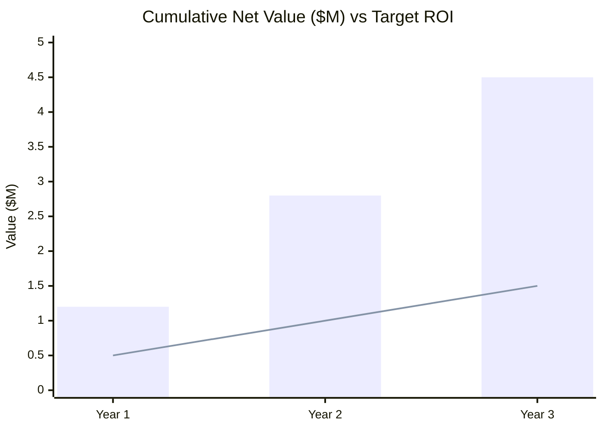

# Business Value Pitch: Automated Grants and Funding Manager

**1. Executive Summary: The Investment Thesis**
We have a strategic opportunity to transform our grant acquisition pipeline, reducing application assembly time by an estimated 85% and significantly increasing our total funding capacity. By deploying the Automated Grants and Funding Manager, we can automate the most labor-intensive bottlenecks—grant discovery and cross-system data collation—reallocating an estimated 40 person-hours per application away from administrative assembly and toward strategic review and high-value project execution.

**2. The Strategic Imperative: The Cost of Inaction**
Our current grant application process is highly fragmented and manually intensive, requiring project teams to independently cross-reference strategic plans, scour Grants.gov, and manually pull financial metrics from SAP and personnel data from Workday. This slow, disjointed workflow consumes dozens of hours per application, resulting in missed funding deadlines, data transposition errors, and a severe scalability ceiling that artificially limits the volume of grants we can pursue each quarter.

**3. Introducing the Automated Grants and Funding Manager: A Shift from Manual Effort to Automated Excellence**
This AI Agent system automates the end-to-end grant acquisition workflow—from strategic intake to autonomous grant matching and complex data assembly—shifting our team's focus from low-value data entry to high-value review and strategic negotiation.

**4. The Business Value Framework: A Quantified Impact Analysis**

*   **Drive Unprecedented Efficiency:**
    *   Reduce process cycle time from an average of **3-4 weeks** to under **2 days**, an **85%+** improvement in speed-to-submission.
    *   Free up an estimated **40** hours per user, per application, enabling Grant Managers to focus on partner relationship building and project execution.
    *   Increase application processing capacity by an estimated **300%** without requiring additional administrative headcount.

*   **Unlock Significant Hard Cost Savings & Revenue:**
    *   Directly accelerate revenue by increasing the volume of high-quality submissions, projecting an additional **$2.5M+** in secured grant funding annually based on increased at-bats.
    *   Eliminate an estimated **$75,000** annually in administrative overhead and opportunity costs associated with manual data mapping between SAP, Workday, and federal portals.

*   **Fortify Compliance & Reduce Operational Risk:**
    *   Ensure strict alignment with corporate/institutional strategy through automated, objective intake gatekeeping before any drafting effort begins.
    *   Improve data accuracy to over **99.9%** by programmatically fetching real-time financial (SAP) and HR/KPI (Workday) metrics, strengthening our audit and compliance posture for federal applications.

**5. Projected Return on Investment (ROI)**
Based on a conservative model of our current grant volume and success rates, we project that the investment in the Automated Grants and Funding Manager will achieve the following:
*   **Payback Period:** < 4 Months (estimated, upon first major new grant secured)
*   **Year 1 Net Impact (Efficiency + New Funding):** $1.2M+ (estimated)
*   **3-Year ROI:** 450%+ (estimated)

**Visualizing the Impact (3-Year Cumulative Value)**

*(Note: Bar graph represents total net impact including new funding; line graph represents the baseline target ROI expectation).*

**6. Next Steps**
We recommend a 90-day pilot with the core Grants Management department to validate these efficiency projections on a live cohort of upcoming proposals. Our next step is to schedule a deep-dive workshop with operational stakeholders to map the internal SAP/Workday integration and change management strategy.
