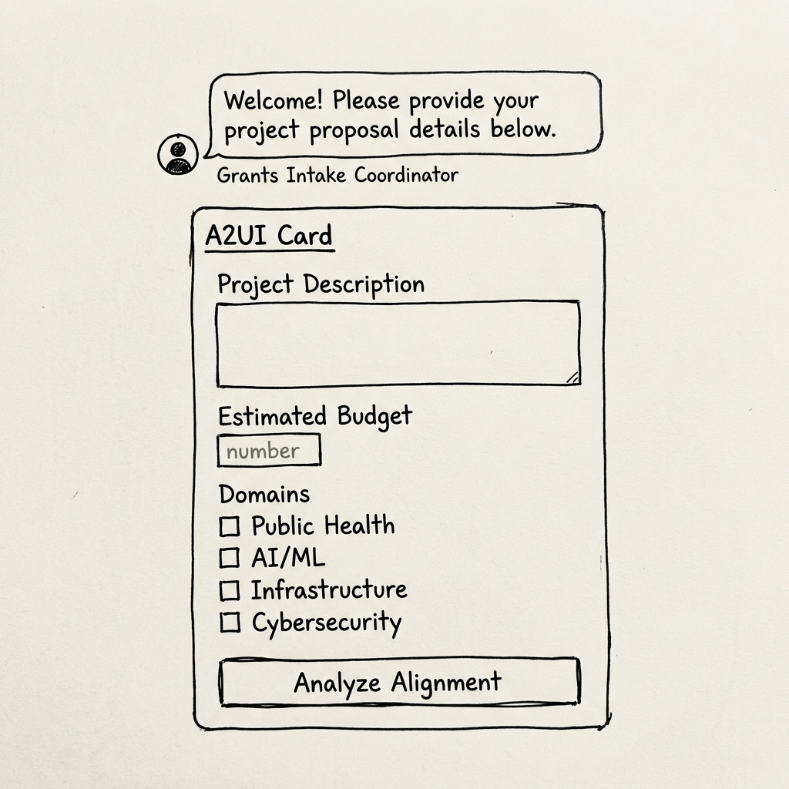
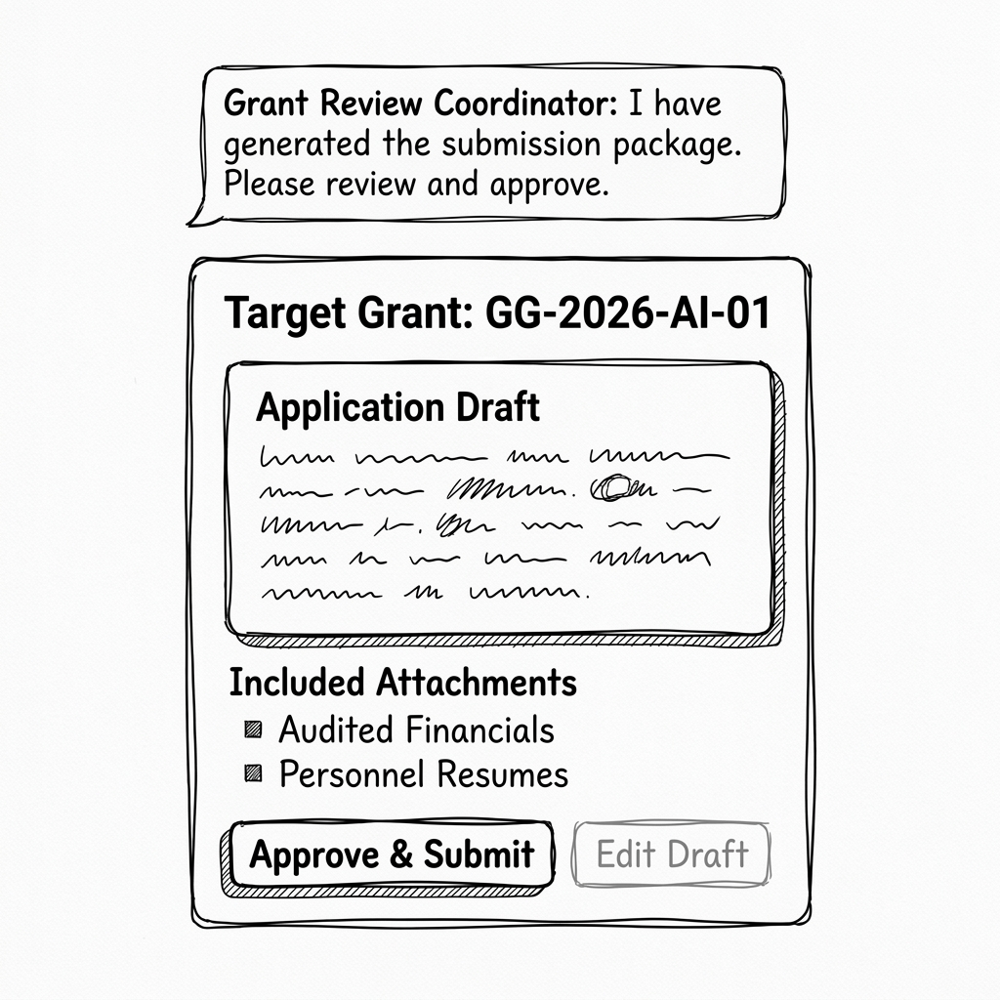

# Grants Funding Manager UX Design Document

This document outlines the Agent-Driven User Interface (A2UI) design for the Grants Funding Manager agent. The goal is to streamline the grant intake and review process using structured UI components.

## 1. Goal
Provide a structured, low-friction interface for Project Managers to submit proposals and for Grant Managers to review and approve generated grant application drafts.

## 2. Flow Breakdown

### Step 1: Proposal Intake
**User Intent:** Submit a new project proposal for funding consideration.
**Agent:** `intake_agent` (Interactive)

**A2UI Components:**
- **Card**: Groups the input fields.
- **TextField (Long Text)**: For the detailed project proposal description.
- **TextField (Number)**: For the estimated budget scale.
- **MultipleChoice / ChoicePicker (Multi-select)**: For the project domains (e.g., Public Health, AI/ML).
- **Button**: "Analyze Alignment" (Triggers the intake analysis).

**Wireframe:**

---

### Step 2: Background Processing (Headless)
**Description:** The system searches for grants (`search_agent`) and compiles data to draft the application (`drafting_agent`).
**A2UI UX:** The UI should show a waiting/loading state provided by the platform.

---

### Step 3: Review & Approve
**User Intent:** Review the generated draft and approve compilation/submission package.
**Agent:** `review_prep_agent` (Interactive)

**A2UI Components:**
- **Card**: Container for the review summary.
- **Inner Card**: Displays the "Application Draft" preview text.
- **List / Column**: Lists "Included Attachments" (e.g., SAP Financials, Workday Resumes).
- **Button (Primary)**: "Approve & Submit"
- **Button (Secondary)**: "Edit Draft" (or Reject)

**Wireframe:**

## 3. State/Data Requirements
- `project_summary`: Text extracted from intake.
- `budget_required`: Number extracted from intake.
- `project_domain`: Text extracted from intake.
- `selected_grant`: ID of selected grant.
- `application_draft`: Text of generated draft.
