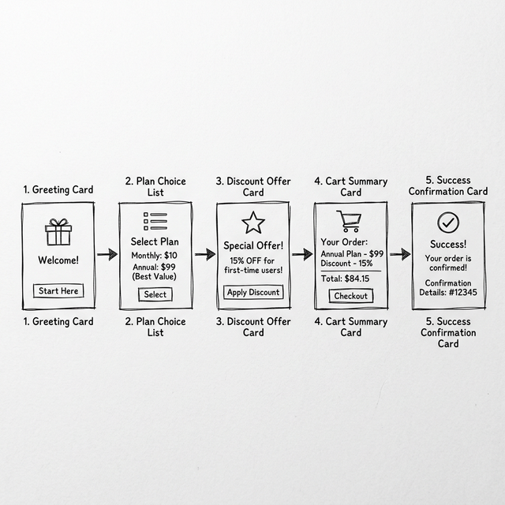
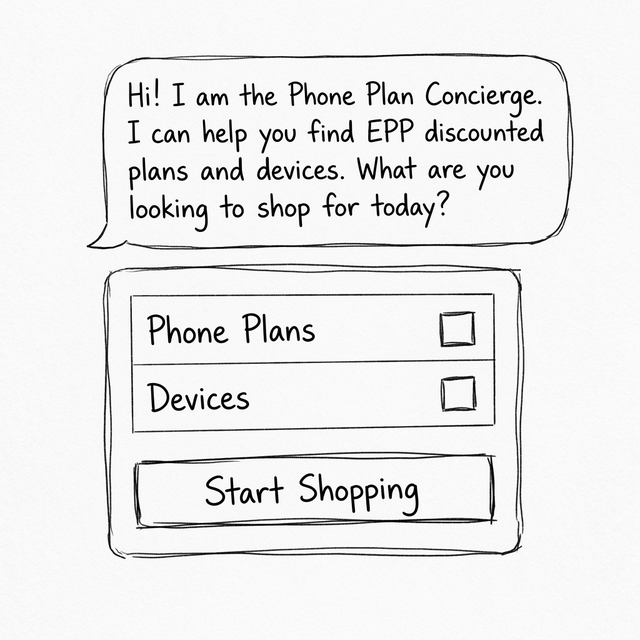
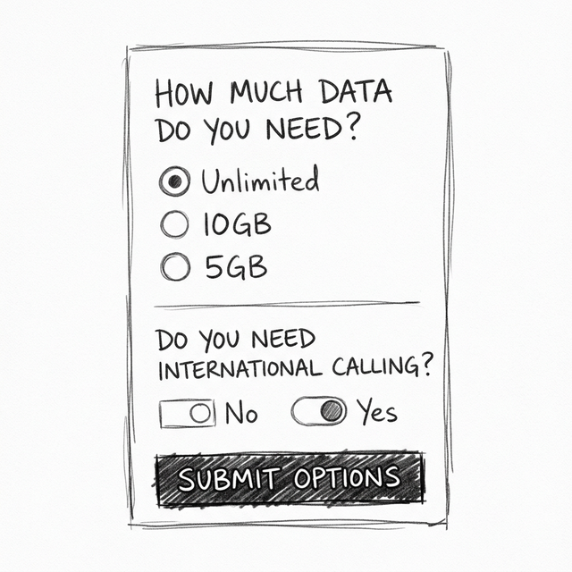
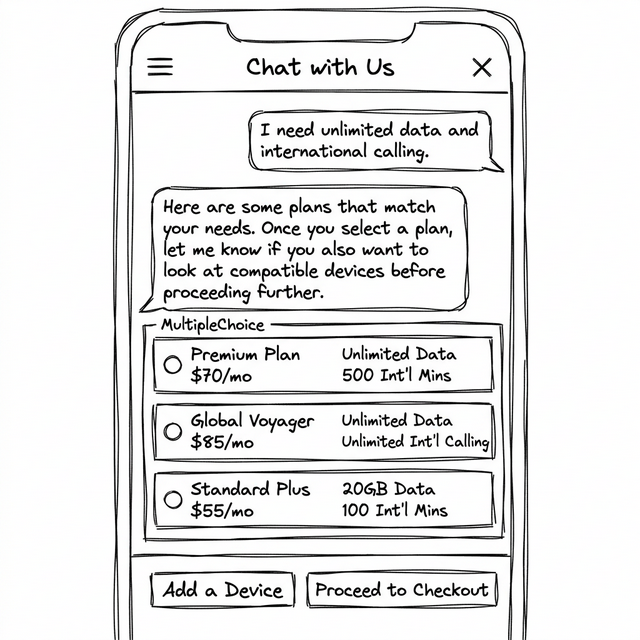
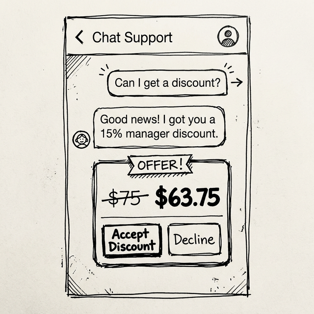
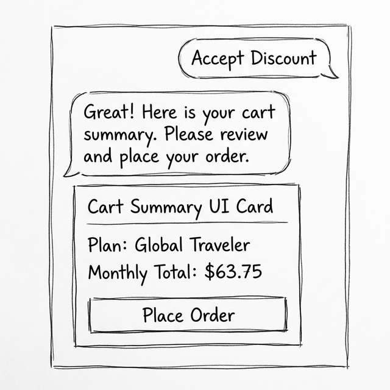
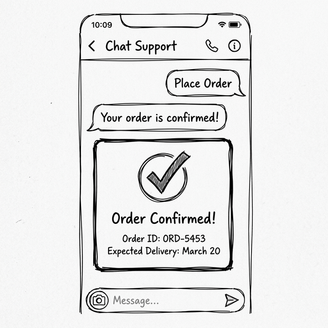

# A2UI UX Design: Phone Plan Shopper

This document formalizes the Agent-Driven UI (A2UI) design flow for the `phone_plan_shopper` agent.

## Overall Flow Chart
A bird's-eye view of the interactive frontend flow.

---

## Step 1: Greeting & Introduction
- **Goal**: Welcome the user and provide easily discoverable initial actions.
- **User Intent**: Initiate the conversation.
- **Agent Conversational Response**: "Hi! I am the Phone Plan Concierge. I can help you find EPP discounted plans and devices."
- **A2UI Components**: A `Card` with `CheckBox`es for "Phone Plans" and "Devices", along with a "Start Shopping" `Button`, allowing the agent to capture exactly what the user is shopping for upfront.

---

## Step 2: Needs Assessment
- **Goal**: Gather explicit requirements from the user regarding data limits and international calling to filter plans later.
- **User Intent**: "I want a new phone plan."
- **A2UI Components**: A `Card` asking about data needs with a `MultipleChoice` component acting as radio buttons for 'Unlimited', '10GB', and '5GB', followed by another `MultipleChoice` for 'International Calling' ('Yes' or 'No'). At the bottom of the Card, a single "Find Match" `Button` to submit the entire state to the backend simultaneously.

---

## Step 3: Plan Search Results
- **Goal**: Display eligible plans based on user requirements and confirm if devices are needed.
- **User Intent**: "I need unlimited data and international calling."
- **Agent Conversational Response**: "Here are some plans that match your needs. Once you select a plan, let me know if you also want to look at compatible devices before proceeding further."
- **A2UI Components**: A `MultipleChoice` component wrapping a list of `Card`s for the plans, followed by action `Button`s (e.g., "Add a Device", "Proceed to Checkout").

---

## Step 4: Negotiation / Discount Offer
- **Goal**: Handle explicit requests for discounts by demonstrating value clearly. (Note: Discounts are explicitly *not* offered unless the user asks for them).
- **User Intent**: "Can I get a discount?"
- **Agent Conversational Response**: "Good news! I got you a 15% manager discount."
- **A2UI Components**: A `Card` emphasizing the price drop with the original price crossed out. Includes explicit **Accept Discount** and **Decline** `Button`s.

---

## Step 5: Cart Summary (Checkout Boundary)
- **Goal**: Explicitly confirm the user's choices before booking the order to prevent accidental transactions.
- **User Intent**: "Accept Discount" or "Order that plan."
- **Agent Conversational Response**: "Great! Here is your cart summary. Please review."
- **A2UI Components**: A comprehensive `Card` detailing the Plan, Applied Discount, and Final Total. A prominent "Place Order" `Button`.

---

## Step 6: Order Confirmation
- **Goal**: Confirm success.
- **User Intent**: "Place Order" button click.
- **Agent Conversational Response**: "Your order is confirmed!"
- **A2UI Components**: A Success `Card` displaying the Order ID and expected delivery date.

