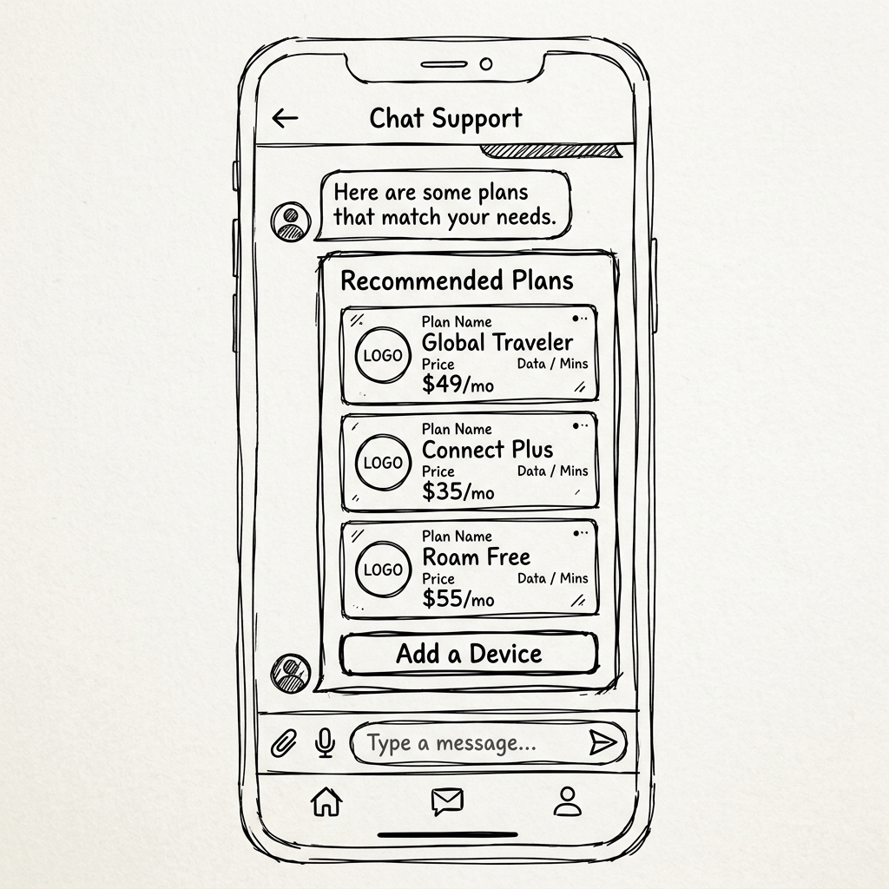
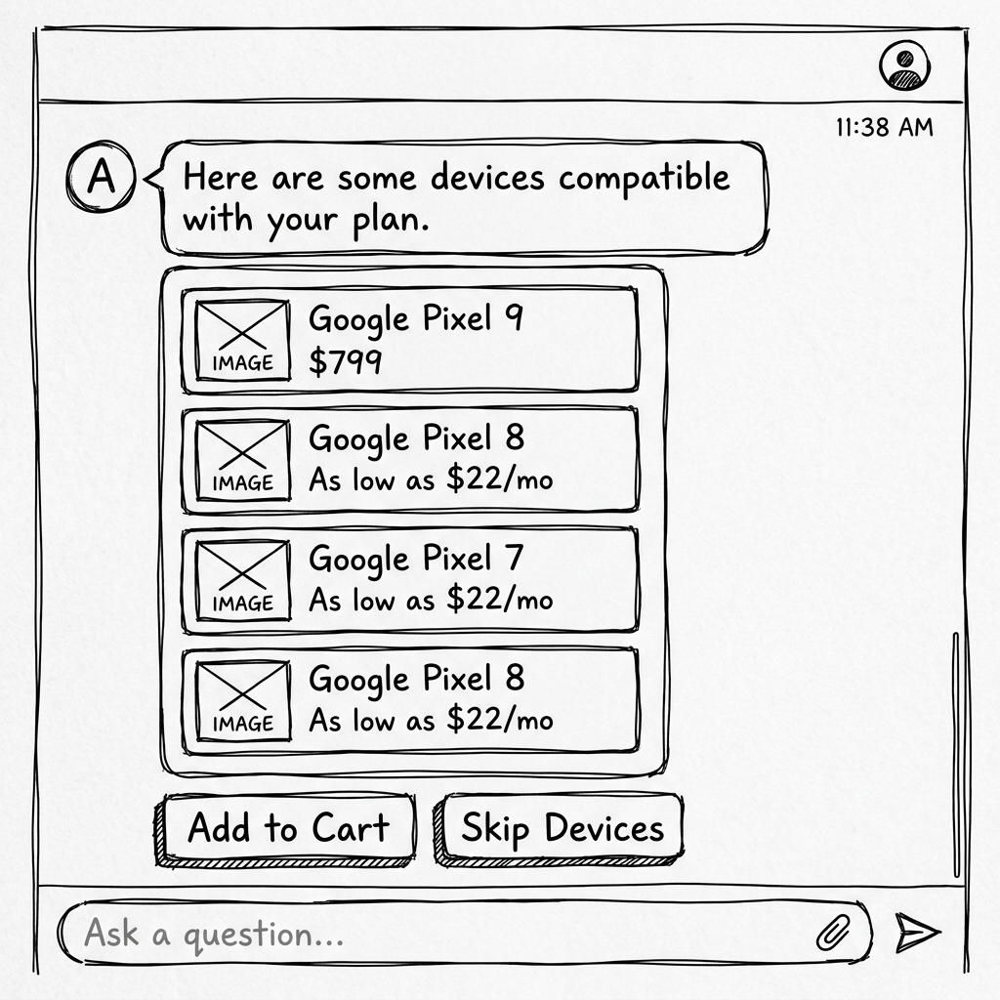

# A2UI UX Design: Phone Plan Shopper (Revised)

This document formalizes the revised Agent-Driven UI (A2UI) design flow for the `phone_plan_shopper` agent, including images for devices and provider logos.

## Overall Flow

1.  **Greeting & Introduction**
2.  **Needs Assessment**
3.  **Plan Search Results** (with Provider Logos)
4.  **Device Selection** (New Step, with Device Images)
5.  **Negotiation / Discount Offer**
6.  **Cart Summary**
7.  **Order Confirmation**

---

## Step 1: Greeting & Introduction
- **Goal**: Welcome the user and provide easily discoverable initial actions.
- **User Intent**: Initiate the conversation.
- **Agent Conversational Response**: "Hi! I am the Phone Plan Concierge. I can help you find EPP discounted plans and devices."
- **A2UI Components**: A `Card` with `CheckBox`es for "Phone Plans" and "Devices", along with a "Start Shopping" `Button`, allowing the agent to capture exactly what the user is shopping for upfront.

---

## Step 2: Needs Assessment
- **Goal**: Gather explicit requirements from the user regarding data limits and international calling to filter plans later.
- **User Intent**: "I want a new phone plan."
- **A2UI Components**: A `Card` asking about data needs with a `MultipleChoice` component acting as radio buttons for 'Unlimited', '10GB', and '5GB', followed by another `MultipleChoice` for 'International Calling' ('Yes' or 'No'). At the bottom of the Card, a single "Find Match" `Button` to submit the entire state to the backend simultaneously.

---

## Step 3: Plan Search Results
- **Goal**: Display eligible plans based on user requirements and include provider logos.
- **User Intent**: "I need unlimited data and international calling."
- **Agent Conversational Response**: "Here are some plans that match your needs. I've included the provider logos so you can easily identify them."
- **A2UI Components**: A `MultipleChoice` component wrapping a list of `Card`s for the plans. Each `Card` contains:
    -   `Image` component for the provider logo.
        -   *AT&T*: `https://upload.wikimedia.org/wikipedia/commons/5/5c/AT%26T-logo_2016.png`
        -   *T-Mobile*: (Placeholder or found URL)
        -   *Verizon*: (Placeholder or found URL)
    -   `Text` components for Plan Name, Data, Price.
-   Followed by action `Button`s: "Add a Device", "Proceed to Checkout".

---

## Step 4: Device Selection (New)
- **Goal**: Display eligible devices for the selected plan and include device images.
- **User Intent**: Clicked "Add a Device" or requested devices.
- **Agent Conversational Response**: "Here are some devices compatible with your plan. Which one would you like?"
- **A2UI Components**: A `MultipleChoice` component wrapping a list of `Card`s for devices. Each `Card` contains:
    -   `Image` component for the device.
        -   *Example (Google Pixel 9)*: `https://upload.wikimedia.org/wikipedia/commons/thumb/b/b8/Google_Pixel_9_%28Wintergreen%29_rear.svg/500px-Google_Pixel_9_%28Wintergreen%29_rear.svg.png`
    -   `Text` components for Brand, Model, Storage, Price.
-   Followed by action `Button`s: "Add to Cart", "Skip Devices".

---

## Step 5: Negotiation / Discount Offer
- **Goal**: Handle explicit requests for discounts by demonstrating value clearly.
- **User Intent**: "Can I get a discount?"
- **Agent Conversational Response**: "Good news! I got you a 15% manager discount."
- **A2UI Components**: A `Card` emphasizing the price drop with the original price crossed out. Includes explicit **Accept Discount** and **Decline** `Button`s.

---

## Step 6: Cart Summary (Checkout Boundary)
- **Goal**: Explicitly confirm the user's choices before booking the order.
- **User Intent**: "Accept Discount" or "Order that plan."
- **Agent Conversational Response**: "Great! Here is your cart summary. Please review."
- **A2UI Components**: A comprehensive `Card` detailing the Plan (with logo), Device (with image if selected), Applied Discount, and Final Total. A prominent "Place Order" `Button`.

---

## Step 7: Order Confirmation
- **Goal**: Confirm success.
- **User Intent**: "Place Order" button click.
- **Agent Conversational Response**: "Your order is confirmed!"
- **A2UI Components**: A Success `Card` displaying the Order ID and expected delivery date.
