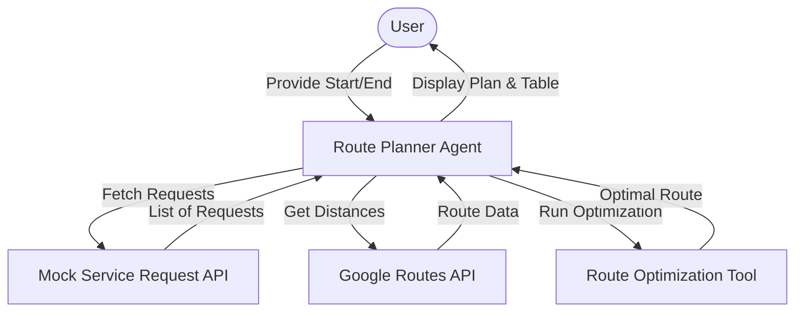
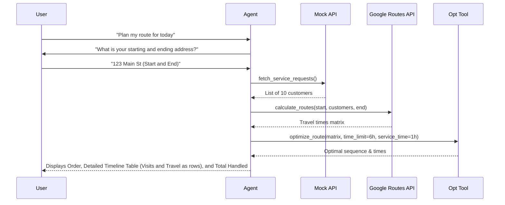

# Route Planner Agent Design Document

## 1. Requirements Analysis
> **Goal**: Clarify what we are building and why.

*   **User Problem**: Field service representatives need to visit multiple customers efficiently within a limited time (6 hours) without wasting time on back-and-forth driving.
*   **Target Outcome**: An optimized route order, a detailed timeline table (including travel as separate rows and duration column), and the total number of customers handled.
*   **Key Constraints**:
    *   **Budget/Cost**: Low cost (efficient use of Maps API).
    *   **Latency**: Near real-time preferred for route generation.
    *   **Tools**: Google Routes API (supports IAM), Mock API for service requests.
*   **clarification_log**:
    *   *Q: Does the 6 hours include travel time?* -> *A: Yes, it includes travel time and the 1-hour service time at each customer.*
    *   *Q: Where does the day start and end?* -> *A: The agent must ask the user for starting and ending addresses (usually the same).*
    *   *Q: What level of routing accuracy is needed?* -> *A: Use Google Routes API to support IAM/ADC authentication without needing static keys.*
    *   *Q: How are requests provided and prioritized?* -> *A: A mock API provides ~10 requests in a geographic area. The agent fits as many as possible within the time limit.*
    *   *Q: What is the start time of the route?* -> *A: The agent should ask the user, defaulting to 9:00 AM if not specified.*

---

## 2. Architecture Design
> **Goal**: Define the structure (Agents, Tools, Flow).

### 2.1 High-Level Strategy
*   **Pattern**: Single Agent (`LlmAgent`) with Tools.
*   **Rationale**: The workflow is strictly linear and sequential (Gather input $\rightarrow$ Fetch data $\rightarrow$ Calculate distances $\rightarrow$ Optimize $\rightarrow$ Report). A single agent can coordinate this flow effectively by calling specialized tools, avoiding the overhead of multi-agent communication.

### 2.2 System Diagram (Logical)


### 2.3 Components
#### **A. Agents**
| Name | Type | Model | Role/Persona |
| :--- | :--- | :--- | :--- |
| `route_planner_agent` | `LlmAgent` | `gemini-2.5-flash` | Orchestrates the route planning process, interacts with the user to get locations, and presents the final optimized schedule. |

#### **B. State Schema (`session.state`)**
| Key | Type | Description | Persistence |
| :--- | :--- | :--- | :--- |
| `start_address` | `str` | Starting location for the route | Session |
| `end_address` | `str` | Ending location for the route | Session |
| `requests` | `list` | List of fetched service requests | Session |

#### **C. Tools**
| Tool Function | Description | Dependencies |
| :--- | :--- | :--- |
| `fetch_service_requests` | Returns a list of ~10 service requests with addresses in a specific area. | None (Mock Python function) |
| `calculate_routes` | Calculates travel times between all locations (Start, Customers, End). | Google Routes API (Supports IAM) |
| `optimize_route` | Solves the TSP with time constraints to find the best route fitting the 6-hour limit. | Python (OR-Tools or custom algorithm) |

### 2.4 Execution Flow (Sequence)
> **Goal**: Visualize the runtime interaction.



---

## 3. Evaluation Plan
> **Goal**: Define how we verify success.

### 3.1 Strategy
*   **Methodology**: Automated unit tests for the optimization logic and manual review for the agent interaction flow.
*   **Tools**: `pytest` for the optimization tool.

### 3.2 Metrics
1.  **Success Rate**: Percentage of runs where a valid route is produced.
2.  **Efficiency**: Reduction in total travel time compared to a naive (alphabetical or random) route.
3.  **Validity**: Total time (travel + service) must strictly be $\le$ 6 hours.

### 3.3 Test Scenarios
#### **Scenario 1: Happy Path**
*   **Input**: 3 requests nearby (leaving ample time for travel).
*   **Expected Output**: All 3 scheduled, total time < 6 hours.

#### **Scenario 2: Overload**
*   **Input**: 10 requests spread far apart.
*   **Expected Behavior**: Agent drops requests that don't fit and schedules a subset that fits within 6 hours.

#### **Scenario 3: Invalid Input**
*   **Input**: User provides an unreachable address.
*   **Expected Behavior**: Agent asks for a valid address or skips it gracefully.

---

## 4. Development & Testing Considerations
> **Goal**: Document environment-specific behaviors and setup.

### 4.1 Environment Differences
*   **Local**: Uses the mock API for requests. Can use mock distance data to save costs during development or real Google Maps API if configured.

### 4.2 Local Setup
*   Supports IAM/ADC authentication for the Routes API (no hardcoded key required if the environment is authorized), or an optional `GOOGLE_MAPS_API_KEY` as a fallback.

### 4.3 IAM Authentication Setup
To use the Routes API without a hardcoded key, follow these steps:

1.  **Enable the API**: In the Google Cloud Console, enable the **Routes API** for your project.
2.  **Local Setup (ADC)**: Run `gcloud auth application-default login` in your terminal to authenticate your local environment.
3.  **Code Implementation**: Use the `google-auth` library to fetch credentials automatically in your tool:
    ```python
    from google.auth import default
    from google.maps import routes_v1
    
    credentials, project_id = default()
    client = routes_v1.RoutesClient(credentials=credentials)
    ```
4.  **Deployment**: Ensure the Service Account attached to the deployment resource has access to the project.
