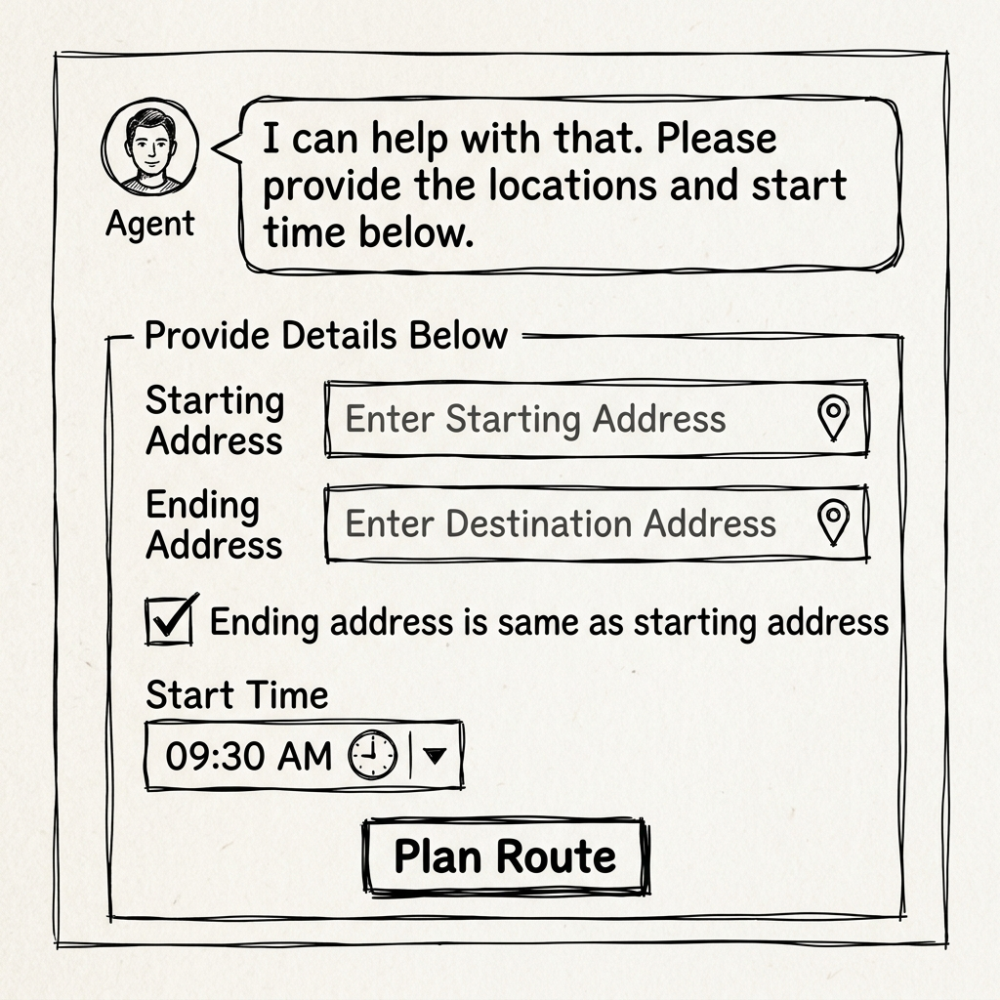
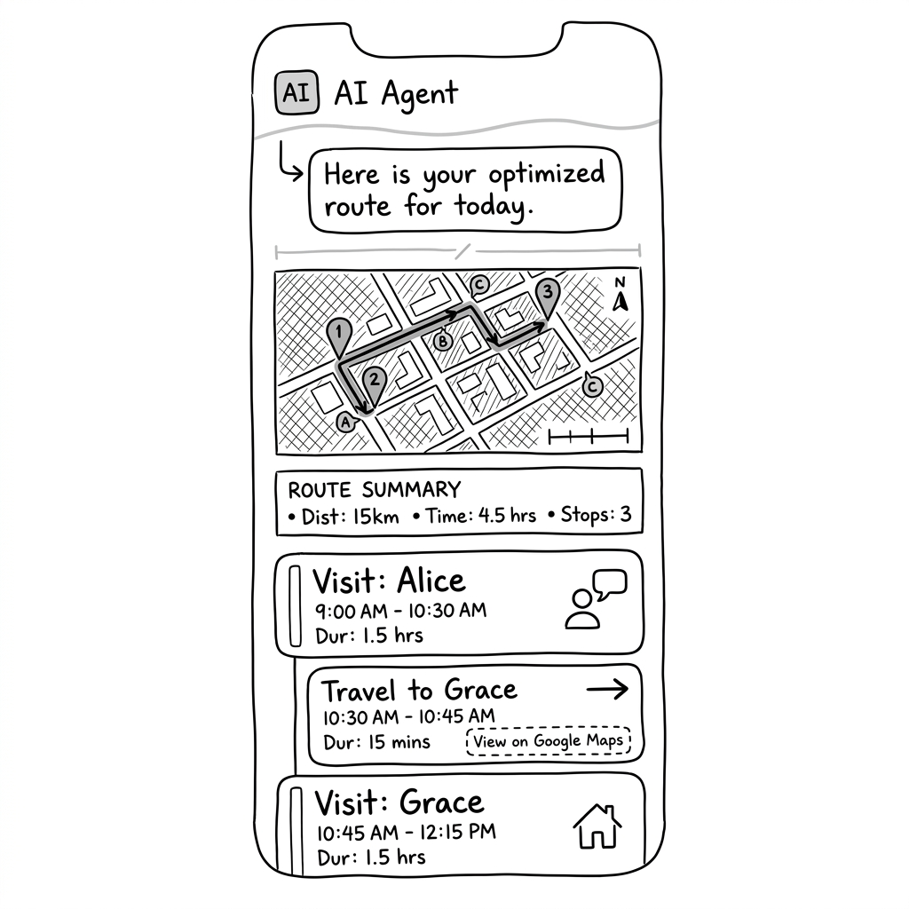

# Route Planner Agent - UX Design Document

## Goal
Provide a user-friendly interface for field service representatives to plan their daily routes efficiently within a 6-hour limit.

## UX Evaluation Findings (from "Dumb User" Testing)
*   **Conversational Weakness**: The agent accepts invalid addresses ("Somewhere in USA") and conflicting information (claiming start and end are the same but providing different addresses) without validation.
*   **Design Solution**: Use structured A2UI components (Forms) to gather input reliably, prevent user error, and reduce friction.

---

## Proposed Flow

### Step 1: Initiation & Intake
The user asks to plan a route. The agent responds with a structured form to gather details instead of relying on multi-turn conversation for each field.

*   **User Intent**: "Plan my route for today"
*   **Agent Response**: "I can help with that. Please provide the locations and start time below."
*   **A2UI Components**:
    *   `Column` (Parent Layout)
        *   `TextField`: Label="Starting Address", Placeholder="Enter full address"
        *   `TextField`: Label="Ending Address", Placeholder="Enter full address"
        *   `CheckBox`: Label="Ending address is same as starting address" (Client-side logic should toggle the visibility or disabled state of the Ending Address field)
        *   `DateTimeInput`: Label="Start Time", enableTime=true, enableDate=false (Defaults to 9:00 AM if not specified)
        *   `Button`: Label="Plan Route", Action="submit_route_plan"

### Step 2: Results & Timeline
After processing, the agent displays the optimized route as an interactive map and a detailed timeline.

*   **Agent Response**: "Here is your optimized route for today. I managed to fit X customers within your 6-hour limit."
*   **A2UI Components**:
    *   `Column` (Parent Layout)
        *   **Custom Component**: `InteractiveMap` (Requires Custom Catalog)
            *   *Description*: Renders a map with markers for each stop and a drawn route path.
            *   *Data*: List of geocoded points (lat/lng) and sequence order.
        *   **Header Card**: Summary of total time used and customers handled.
        *   **Timeline List**: A sequence of `Card` components representing the day's flow.
            *   *Visit Card*:
                *   Title: "Visit: [Customer Name]"
                *   Subtitle: "[Address]"
                *   Time: "09:05 AM - 10:05 AM (60 mins)"
            *   *Travel Card* (Subtle style or smaller):
                *   Title: "🚗 Travel to [Next Location]"
                *   Time: "10:05 AM - 10:20 AM (15 mins)"
                *   **Button**: Label="View on Google Maps", Action="open_map", Context=`{"url": "https://www.google.com/maps/dir/?api=1&origin=...&destination=..."}`
        *   **Footer Card**: List of skipped customers due to time constraints.

---

## State Requirements
*   `start_address` (str)
*   `end_address` (str)
*   `start_time` (str)
*   `schedule` (list of dicts containing activity, customer, start_time, end_time, duration)

---

## Custom Component: `InteractiveMap`
To support Option 2, the agent will emit a component with the following expected structure, requiring the client to support a custom catalog (e.g., `https://my-company.com/a2ui/v0_1/custom_catalog.json`).

### Component Definition
*   **component**: `"InteractiveMap"`
*   **id**: `string` (Unique ID)
*   **props**:
    *   **center**: `{"lat": float, "lng": float}` (Optional center of the map)
    *   **zoom**: `integer` (Optional default zoom level)
    *   **markers**: `list` of:
        *   `{"lat": float, "lng": float, "label": string, "color": string}`
    *   **polyline**: `string` (Encoded polyline for the route path)
