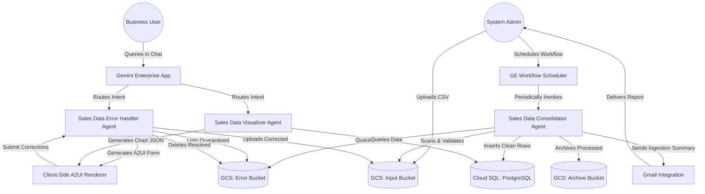

# Sales Data Agentic Application
## Cohesive Multi-Agent Platform for Automated Data Ingestion, Interactive Repair, and Conversational Business Intelligence

This repository contains the **Sales Data Agentic Application**, an end-to-end, multi-agent solution designed to automate the ingestion, validation, human-in-the-loop repair, and conversational analysis of daily state-level sales data. By combining three specialized AI agents under a unified architecture, this application bridges the gap between raw, unstructured data ingestion and high-impact business decision-making.

---

## 1. Executive Summary & Business Problem

Distributed enterprise operations often rely on daily sales uploads from individual retail stores or regional offices. This manual upload model suffers from three primary operational bottlenecks:
1.  **Ingestion Failures (Dirty Data)**: Typographical errors, negative sales amounts, incorrect date formats, and missing columns frequently break traditional ETL (Extract, Transform, Load) pipelines, stalling daily reporting.
2.  **Manual Remediation Bottlenecks**: Correcting dirty data traditionally requires manual IT intervention, exporting files, exchanging emails, and re-uploading, leading to high operational latency and data-loss risks.
3.  **Delayed Business Intelligence (BI)**: Even after data is ingested, business executives must rely on static dashboards or queue up requests with BI teams to analyze performance trends.

### The Solution: An Integrated Agentic Application
The **Sales Data Agentic Application** solves these challenges by deploying three collaborative AI agents, each specializing in a phase of the data lifecycle:

```
    [ Regional Sales Files ]
               │
               ▼
    ┌─────────────────────────┐
    │ 1. Sales Consolidator   │ ──( Valid? )──► [ Ingest to Cloud SQL ]
    └─────────────────────────┘                                │
        ▲                  │                                   ▼
        │              ( Invalid )                   ┌─────────────────────────┐
        │                  │                         │  3. Sales Visualizer    │
    ( Resubmit )           ▼                         └─────────────────────────┘
        │      ┌─────────────────────────┐
        └──────│ 2. Sales Error Handler  │
               └─────────────────────────┘
```

1.  **Sales Data Consolidator**: Orchestrates the automated landing, syntactic validation, and ingestion of daily state-level sales CSV files. This agent can be scheduled to run periodically by an administrator in the Gemini Enterprise App as a **no-code workflow agent**. The workflow can be further customized to complete the file processing and automatically send a summary email of the ingestion results (successful vs. quarantined files) using the built-in integrations of Gemini Enterprise.
2.  **Sales Data Error Handler (A2UI)**: Empowers business users to inspect, interactively edit, and resubmit quarantined data directly in their chat feed using a secure, responsive, and stateful Agent-Driven User Interface (A2UI). Repaired files are uploaded back to the input bucket for reprocessing by the Consolidator.
3.  **Sales Data Visualizer**: Provides real-time, conversational analytics, allowing business leaders to query the consolidated SQL database in natural language and receive interactive, animated charts.

> [!NOTE]
> **Agent Development Progression**: The repository also preserves the intermediate conversational agent [[sales_data_error_handler](file:///usr/local/google/home/veermuchandi/code/agents/rad-workshop/sales_data_agentic_app/sales_data_error_handler)]. This agent serves as the pure conversational prototype before adding A2UI visual cards, illustrating how to build and test the core tool-calling reasoning loop.

---

## 2. Multi-Agent System Architecture

The application leverage a hub-and-spoke architecture built on **Google Cloud Storage (GCS)**, **Cloud SQL (PostgreSQL)**, **Vertex AI Agent Engine (Reasoning Engines)**, and **Gemini Enterprise**.



### Data Flow Lifecycle
1.  **Ingestion**: CSV sales files are uploaded to the GCS Input Bucket.
2.  **Consolidation & Quarantine**: The `Sales Data Consolidator` scans the input bucket. Clean files are loaded into `Cloud SQL` and archived. Erroneous files are immediately quarantined by moving them to the GCS Error Bucket.
3.  **Notification & Repair**: The user opens the `Sales Data Error Handler` in Gemini Enterprise. The agent renders a high-fidelity **Discovery Dashboard** listing the quarantined files. Clicking **Inspect** on a file dynamically renders a **Repair Form** highlighting specific row-level validation errors.
4.  **Resubmission**: The user corrects the values in the text fields and clicks **Submit All Fixes**. The agent automatically:
    *   Generates a corrected, clean CSV.
    *   Uploads the clean CSV back to the GCS Input Bucket (triggering a clean ingestion).
    *   Deletes the quarantined file from the GCS Error Bucket.
5.  **Visualization**: The user asks the `Sales Data Visualizer` to analyze the newly ingested data (e.g., *"Show me today's sales trends"*). The agent queries the database and renders an interactive, animated line chart.

---

## 3. Secure Code Governance & Secrets Management

To ensure enterprise-grade security and prevent the exposure of sensitive configurations, this repository strictly adheres to **Zero-Secrets Hardcoding**:
*   **Git Protection**: A comprehensive `.gitignore` file blocks all project-specific credentials, state files, and local environment files from being pushed to source control.
*   **Configuration Externalization**: All deployment variables (GCP Project IDs, Regions, Bucket Names, Database Passwords, and OAuth Client secrets) are externalized into local, untracked `terraform.tfvars`, `.env` files, or injected at runtime using environment variables.
*   **Runtime Secrets**: Production database credentials are secure and loaded dynamically at runtime via environment variables or integrated GCP Secret Manager paths.

---

## 4. Step-by-Step Deployment Guide

### Prerequisites
*   A Google Cloud Project with billing enabled.
*   The Google Cloud SDK (`gcloud`) and Terraform installed locally.
*   Authorized access to the target project:
    ```bash
    gcloud auth login
    gcloud auth application-default login
    ```

### Step 4.1: Deploying the Infrastructure (Storage & Database)
1.  Navigate to the `sales_data_consolidator/deploy_gcs` directory and run Terraform to provision the GCS buckets (`input`, `error`, and `archive` buckets):
    ```bash
    cd sales_data_consolidator/deploy_gcs
    terraform init
    terraform apply -auto-approve
    ```
2.  Navigate to the `sales_data_consolidator/deploy_db` directory to provision the PostgreSQL Cloud SQL instance and database:
    ```bash
    cd ../deploy_db
    terraform init
    terraform apply -auto-approve
    ```
3.  Execute the database initialization script to create the schema and tables:
    ```bash
    cd ..
    python3 db_init.py
    ```

### Step 4.2: Deploying the AI Agents (Vertex AI Reasoning Engines)
The three agents are packaged and deployed as Python Reasoning Engines.

#### 1. Deploy the Sales Data Consolidator
```bash
cd sales_data_consolidator/deploy
terraform init
terraform apply -auto-approve
```

#### 2. Deploy the Sales Data Error Handler (A2UI)
This agent utilizes the dynamic surface ID rewrite engine to prevent card collisions in chat feeds:
```bash
cd ../../deploy_sales_data_error_handler_a2ui
terraform init
terraform apply -auto-approve
```

#### 3. Deploy the Sales Data Visualizer
```bash
cd ../sales_data_visualizer/deploy
terraform init
terraform apply -auto-approve
```

---

## 5. Gemini Enterprise App Registration & OAuth Setup

To make the agents available to your users inside the **Gemini Enterprise** chat experience, you must set up user authentication and register the agents.

### Step 5.1: Create the Google Web OAuth Client
Because the agents interact with secure Google Cloud resources on behalf of the user, you must register a Web OAuth Client:
1.  Open the Cloud Console Credentials page:
    [console.cloud.google.com/apis/credentials](https://console.cloud.google.com/apis/credentials)
2.  Click **Create Credentials** -> **OAuth client ID**.
3.  Set the **Application type** to `Web application`.
4.  Add the following two **Authorized redirect URIs**:
    *   `https://vertexaisearch.cloud.google.com/oauth-redirect`
    *   `https://vertexaisearch.cloud.google.com/static/oauth/oauth.html`
5.  Click **Create** and copy the generated **Client ID** and **Client Secret**.

### Step 5.2: Register the Agents in Gemini Enterprise
1.  Navigate to the `deploy_sales_data_error_handler_a2ui` folder:
    ```bash
    cd ../../deploy_sales_data_error_handler_a2ui
    ```
2.  Run the automated registration script using your OAuth Client credentials (the script will dynamically fetch the active Reasoning Engine card, resolve the URL placeholder, create the global OAuth resource, and register the agent with your Gemini Enterprise App):
    ```bash
    OAUTH_CLIENT_ID="[YOUR_CLIENT_ID]" \
    OAUTH_CLIENT_SECRET="[YOUR_CLIENT_SECRET]" \
    python3 register_production.py
    ```
3.  Repeat the registration process for the `Sales Data Consolidator` and `Sales Data Visualizer` agents using their respective registration scripts located in their deployment folders.

### Step 5.3: Accessing the Application
Once registered, the agents will be visible under the **Agents** panel in the Gemini Enterprise Chat interface. Users can select the **Sales Data Error Handler** to inspect and repair data, and the **Sales Data Visualizer** to converse with their sales dashboard in real-time!
