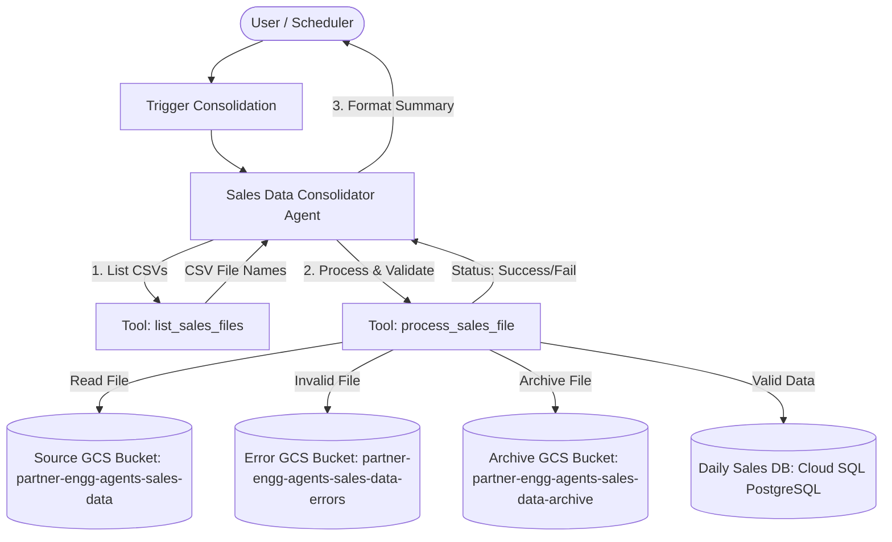
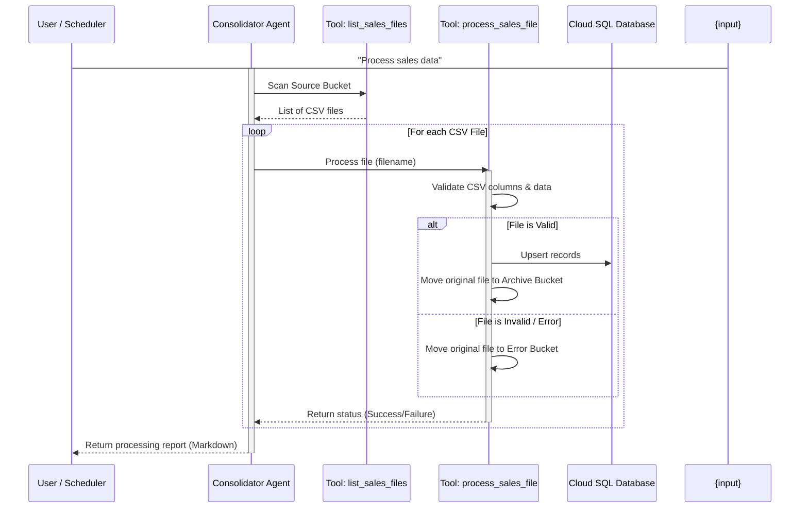

# Sales Data Consolidator Agent Design Document

## 1. Requirements Analysis

*   **User Problem**: Daily sales data files (CSV format) for different locations are uploaded to a cloud storage bucket. The user needs to process these files, validate their content, insert/upsert the data into a centralized database table, quarantine invalid files, and get a summary report of the execution.
*   **Target Outcome**: A single ADK agent that automates the consolidation workflow, providing reliable ingestion, error isolation, and clear operational reporting.
*   **Key Constraints**:
    *   **GCP Project ID**: `partner-engg-agents`
    *   **GCP Location**: `us-central1`
    *   **Budget/Cost**: Low cost, utilizing `gemini-2.5-flash` model.
    *   **Latency**: Ingestion is batch-oriented but should process files in seconds per file.
    *   **Robustness**: Error-tolerant. Mismatched schemas or processing errors must not crash the run; instead, files should be safely quarantined in an error bucket.
    *   **Duplicate Handling**: Must perform upserts (overwriting existing records on conflict) to prevent duplicate entries if a file is re-processed.

---

## 2. Architecture Design

### 2.1 High-Level Strategy
*   **Pattern**: Single Agent (`LlmAgent`)
*   **Rationale**: The flow is linear, procedural, and tool-driven. There are no conversational routing or multi-agent planning requirements. A single agent keeps execution simple, readable, and highly efficient.

### 2.2 System Diagram (Logical)

### 2.3 Components

#### **A. Agents**
| Name | Type | Model | Role/Persona |
| :--- | :--- | :--- | :--- |
| `sales_data_consolidator` | `LlmAgent` | `gemini-2.5-flash` | Responsible for orchestrating the file scanning, invoking processing/validation tools for each file, tracking stats, and presenting the final consolidation report. |

#### **B. State Schema (`session.state`)**
| Key | Type | Description | Persistence |
| :--- | :--- | :--- | :--- |
| `processed_count` | `int` | Number of files successfully processed. | Session |
| `rejected_count` | `int` | Number of files rejected/quarantined. | Session |
| `processed_files` | `list` | Names of successfully processed files. | Session |
| `rejected_files` | `list` | Names of rejected files. | Session |

#### **C. Tools**
| Tool Function | Description | Dependencies |
| :--- | :--- | :--- |
| `list_sales_files` | Lists all `.csv` files inside the source GCS bucket. | `google-cloud-storage` |
| `process_sales_file` | Downloads, validates column schema/data types, performs database upsert, and moves the GCS file (to the archive bucket if successful, or to the error bucket if invalid). | `google-cloud-storage`, `psycopg2` or `sqlalchemy` |

---

### 2.4 Execution Flow (Sequence)

---

## 3. Evaluation Plan

### 3.1 Strategy
*   **Methodology**: Automated integration tests utilizing mock CSV data uploaded to the test bucket.
*   **Tools**: Python `unittest`/`pytest` for tool validation, `adk run` with query replay to test agent orchestration.

### 3.2 Metrics
1.  **Success Ingestion Rate**: 100% of valid CSV files must be parsed and inserted.
2.  **Error Quarantine Rate**: 100% of invalid files must be relocated to the error bucket with no records inserted for those files.
3.  **No Double Counting**: Upsert logic must keep row count consistent if the same file is processed twice.

### 3.3 Test Scenarios

#### **Scenario 1: Happy Path**
*   **Input CSV**: `sales_boston_20260618.csv` (correct headers, valid dates, positive sales amounts).
*   **Expected Behavior**: All rows inserted into `daily_sales` table; file moved to archive bucket; stats report 1 processed file, 0 rejected.

#### **Scenario 2: Schema Error / Quarantine**
*   **Input CSV**: `sales_ny_invalid.csv` (missing `product_line` column or containing non-numeric sales).
*   **Expected Behavior**: 0 rows inserted; file moved to error bucket; stats report 0 processed files, 1 rejected.

#### **Scenario 3: Empty / No Files Path**
*   **Input**: GCS source bucket is empty.
*   **Expected Behavior**: Agent reports "No new files found to process", stats show 0 processed, 0 rejected.

---

## 4. Development & Testing Considerations

### 4.1 Environment Differences
*   **Authentication**: Local development uses Application Default Credentials (ADC) via `gcloud auth application-default login`. Production runs via a Google Cloud Service Account attached to Vertex AI Agent Engine.
*   **Database Access**: Local requires Cloud SQL Auth Proxy to connect securely to the database.

### 4.2 Local Setup & Mock Data
For development and verification, mock files will be generated under `./mock_data` and can be uploaded using standard `gsutil` or Python script commands.

*   `sales_boston_valid.csv` (Valid headers and content)
*   `sales_chicago_invalid.csv` (Missing columns or bad date format)
*   `sales_sf_valid.csv` (Valid headers and content)
