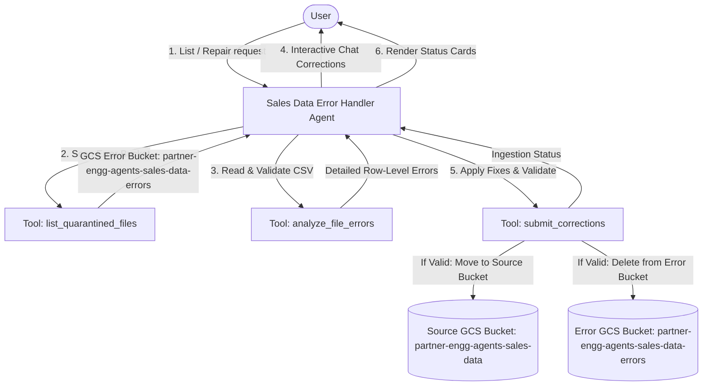
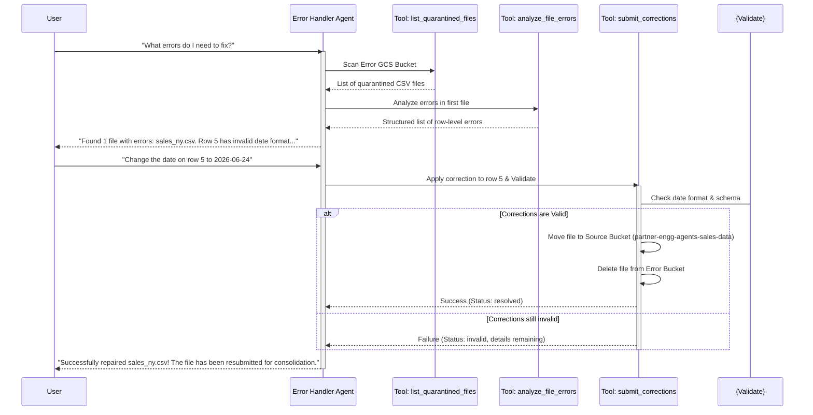

# Sales Data Error Handler Agent Design Document

## 1. Requirements Analysis

*   **User Problem**: When the `Sales Data Consolidator Agent` processes incoming sales files, it quarantines invalid files (e.g., those with schema errors, bad dates, or negative sales values) into an error GCS bucket (`partner-engg-agents-sales-data-errors`). There is currently no automated or interactive way for users to see these errors, correct them, and resubmit the files.
*   **Target Outcome**: A specialized interactive ADK agent that scans the error bucket, presents specific validation errors to the user, allows the user to repair the errors interactively via chat (or by uploading a corrected CSV), validates the repairs, and moves the corrected files back to the primary bucket for reprocessing.
*   **Key Constraints**:
    *   **GCP Project ID**: `agentspace-demo-1145-b` (inherited from the active workshop environment)
    *   **GCP Location**: `us-central1`
    *   **Budget/Cost**: Minimal, running on `gemini-2.5-flash`.
    *   **Latency**: Real-time interactive conversation.
    *   **Interactive Repair**: Must support natural language corrections (e.g., *"Change date on row 5 to 2026-06-24"*) and direct CSV uploads.
    *   **Validation**: The agent must validate corrections against the strict schema of the consolidator before resubmitting.
    *   **Resubmission**: Successful repairs must move the file back to the primary source bucket (`partner-engg-agents-sales-data`) to trigger reprocessing.

---

## 2. Architecture Design

### 2.1 High-Level Strategy
*   **Pattern**: Single Agent (`LlmAgent`)
*   **Rationale**: The agent's requirements—listing quarantined files, scanning them for validation errors, and applying row-level edits—are best served by a single conversational agent equipped with powerful GCS and validation tools. A single agent keeps the conversation cohesive and the execution pipeline highly efficient.

### 2.2 System Diagram (Logical)


---

### 2.3 Components

#### **A. Agents**
| Name | Type | Model | Role/Persona |
| :--- | :--- | :--- | :--- |
| `sales_data_error_handler` | `LlmAgent` | `gemini-2.5-flash` | An empathetic, precise data quality engineer. Helps the user inspect quarantined files, guides them row-by-row through errors, and assists with repairs and resubmissions. |

#### **B. State Schema (`session.state`)**
| Key | Type | Description | Persistence |
| :--- | :--- | :--- | :--- |
| `active_file` | `str` | Name of the GCS file currently being repaired. | Session |
| `active_errors` | `list` | List of validation errors for the active file. | Session |

#### **C. Tools**
| Tool Function | Description | Dependencies |
| :--- | :--- | :--- |
| `list_quarantined_files` | Scans the error GCS bucket and returns a list of quarantined `.csv` files. If empty, reports the bucket is clear. | `google-cloud-storage` |
| `analyze_file_errors` | Downloads the selected quarantined CSV file from the error bucket, runs column and row-level validations, and returns a structured list of error reasons with row numbers and values. | `google-cloud-storage`, `csv` |
| `submit_corrections` | Receives specific row-level updates (or new file content), rewrites the CSV, validates it, and if 100% valid, copies the file back to the primary source bucket and deletes it from the error bucket. | `google-cloud-storage`, `csv` |

---

### 2.4 Execution Flow (Sequence)



---

## 3. Evaluation Plan

### 3.1 Strategy
*   **Methodology**: Automated replay tests using `adk run --replay` with a predefined sequence of queries (mocking error listing, correction application, and invalid correction rejection).
*   **Verification**: Unit tests on the validation logic in `submit_corrections` to ensure no invalid CSV files can bypass the guardrails.

### 3.2 Metrics
1.  **Repair Success Rate**: 100% of valid user corrections must result in successful file relocation to the source bucket.
2.  **Validation Strictness**: 100% of invalid corrections must be rejected with clear feedback pointing to the remaining errors.
3.  **Clean-up Integrity**: Corrected files must be deleted from the error bucket upon successful resubmission to prevent duplicate processing.

---

### 3.3 Test Scenarios

#### **Scenario 1: Happy Path (Natural Language Repair)**
*   **Input GCS**: `sales_chicago_error.csv` containing:
    ```csv
    date,location,product_line,sales
    2026/06/18,Chicago,Electronics,-500.0
    ```
*   **User Action**: *"Change date on row 2 to 2026-06-18 and sales to 500"*
*   **Expected Behavior**: Agent applies the fixes, validates the new row `2026-06-18,Chicago,Electronics,500.0`, moves the file to the source bucket, deletes it from the error bucket, and reports success.

#### **Scenario 2: Direct CSV Upload Repair**
*   **User Action**: Uploads a corrected CSV file with the same name containing valid headers and rows.
*   **Expected Behavior**: Agent validates the uploaded file, overwrites the quarantined version, moves it to the source bucket, and deletes it from the error bucket.

#### **Scenario 3: Invalid Correction Guardrail**
*   **User Action**: *"Change sales on row 2 to -100"*
*   **Expected Behavior**: Agent rejects the correction, explaining that sales cannot be negative, and keeps the file in the error bucket.

---

## 4. Development & Testing Considerations

### 4.1 Environment Differences
*   **Local Storage**: Local testing will use local directories acting as mock GCS buckets (e.g., `./mock_source_bucket/` and `./mock_error_bucket/`), defined via environment variables `SOURCE_BUCKET` and `ERROR_BUCKET`.
*   **Production GCS**: Reasoning Engine runtime will use the real GCS buckets `partner-engg-agents-sales-data` and `partner-engg-agents-sales-data-errors`.

### 4.2 Local Setup
1.  Create local folders: `./mock_source_bucket` and `./mock_error_bucket`.
2.  Set environment variables:
    ```bash
    export SOURCE_BUCKET="./mock_source_bucket"
    export ERROR_BUCKET="./mock_error_bucket"
    ```
3.  Write a mock erroneous CSV file into `./mock_error_bucket/sales_test.csv` to run E2E conversational testing.
