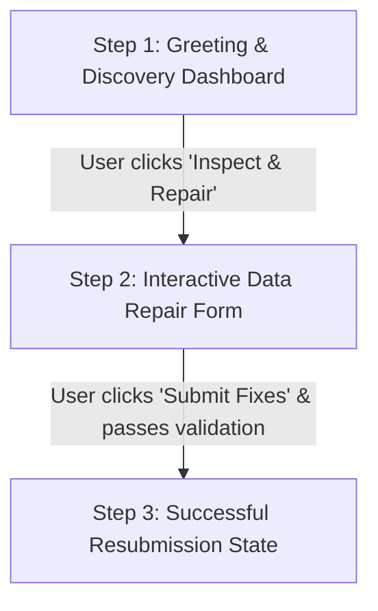
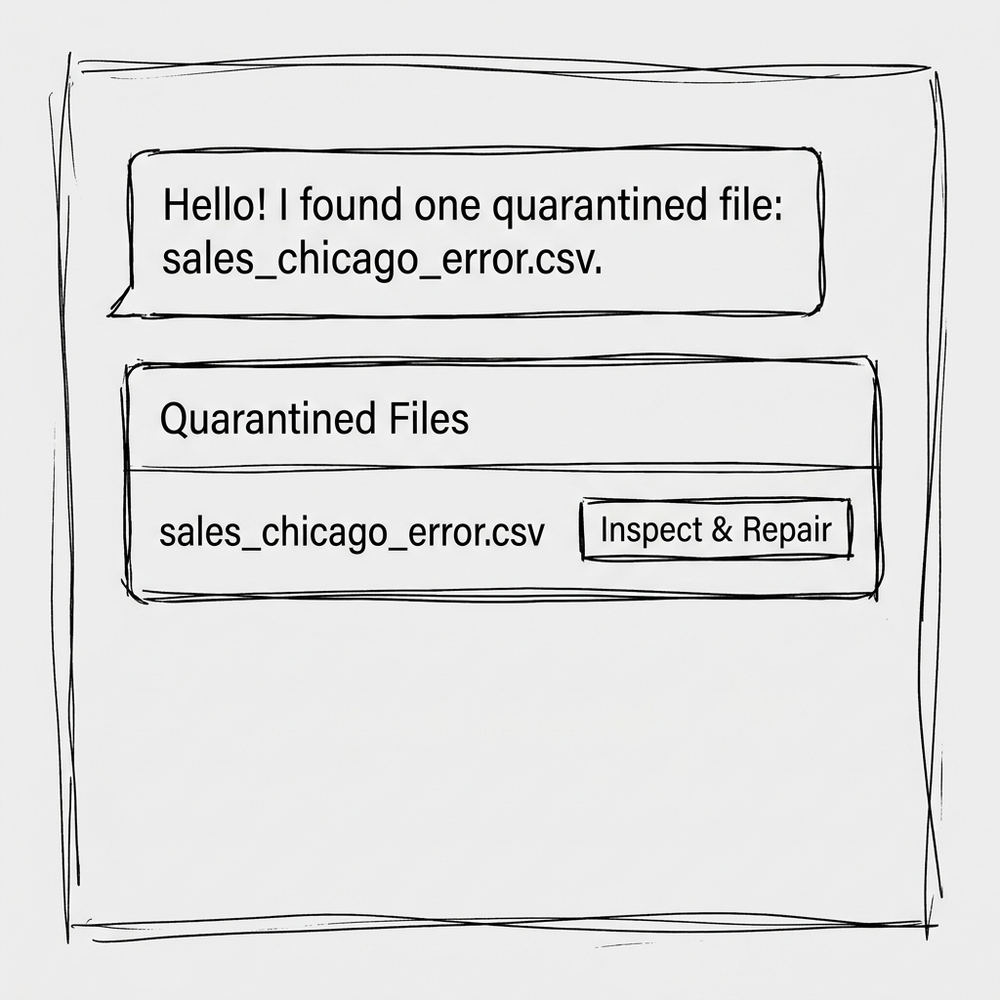
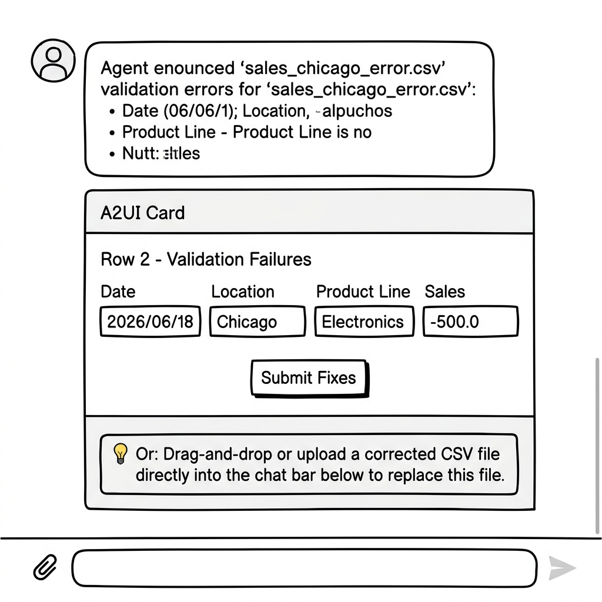

# Sales Data Error Handler - A2UI UX Design Document

## 1. UX Goals & Strategy

*   **Goal**: Maximize the efficiency and accuracy of correcting quarantined sales data files by replacing natural language instructions with a structured, zero-friction, form-based editing interface.
*   **Aesthetics & Design Theme**: 
    *   **Dashboard view**: Clean, card-based list of quarantined files.
    *   **Editor view**: Pre-populated, inline form fields representing the database schema. High-visibility button controls for submission and status updates.
*   **UX Principles Applied**:
    *   *Direct Manipulation*: Pre-populate incorrect cells in edit forms to allow inline modification.
    *   *Immediate Feedback*: Provide clear, row-specific validation error details right next to the fields.
    *   *Implicit Summaries*: Display the final, corrected row structure clearly before submission.

---

## 2. Interactive Flow Breakdown

---

### Step 1: Greeting & File Discovery Dashboard

*   **User Intent**: Start a session to see what files are quarantined.
*   **Agent's Conversational Response**: *"Hello! I'm the Sales Data Error Handler. I found one quarantined file: `sales_chicago_error.csv`."*
*   **A2UI Components Rendered**:
    *   A primary `Card` containing a `Column`.
    *   Header `Text` component: `"Quarantined Files"`.
    *   List item `Card` containing:
        *   `Text` component displaying the file name: `"sales_chicago_error.csv"`.
        *   An interactive `Button` labeled `"Inspect & Repair"`. When clicked, it submits the query *"Inspect sales_chicago_error.csv"* to the chat stream.

#### **Wireframe Mockup**:

---

### Step 2: Interactive Data Repair Form

*   **User Intent**: Inspect the specific errors in the file and repair them.
*   **Agent's Conversational Response**: *"We found some validation errors in `sales_chicago_error.csv`. Please review the issues below."*
*   **A2UI Components Rendered**:
    *   A primary `Card` containing a vertical `Column`.
    *   Header `Text` component: `"Row 2 - Validation Failures"`.
    *   Error Warning `Text` components outlining the specific cell failures (e.g., *"Invalid date format. Expected YYYY-MM-DD"*, *"Sales amount cannot be negative"*).
    *   A horizontal `Row` containing four structured **`TextField`** inputs pre-populated with the row's current values:
        1.  `Date` (Pre-populated with `2026/06/18`)
        2.  `Location` (Pre-populated with `Chicago`)
        3.  `Product Line` (Pre-populated with `Electronics`)
        4.  `Sales` (Pre-populated with `-500.0`)
    *   An interactive **`Button`** labeled `"Submit Fixes"`. When clicked, it sends a structured query to the agent containing the edited values (e.g., *"Change row 2 values to: Date=2026-06-18, Location=Chicago, Product=Electronics, Sales=500.0"*).
    *   A helper **`Text`** block at the bottom of the card with a light background: `"💡 Or: You can drag-and-drop or upload a corrected CSV file directly into the chat bar below to completely replace this file."`

*   **Hybrid Upload Flow**:
    *   The user can attach a corrected version of the CSV file using the chat window's native attachment icon.
    *   The agent detects the attachment, extracts the CSV payload from the incoming message parts, and passes it to the validation and resubmission tool (`submit_corrections`) automatically.

#### **Wireframe Mockup**:

---

### Step 3: Successful Resubmission State

*   **User Intent**: Verify that the corrections are saved and the file is resubmitted.
*   **Agent's Conversational Response**: *"Great news! The file `sales_chicago_error.csv` has been successfully corrected, validated, and resubmitted to the processing pipeline."*
*   **A2UI Components Rendered**:
    *   A success status `Card` showing:
        *   An `Image` or styled `Text` checkmark icon.
        *   Header `Text` component: `"sales_chicago_error.csv - Resolved"`.
        *   Detail `Text` component: `"Status: Success | Ingested to pipeline"`.

#### **Wireframe Mockup**:

---

## 3. Component Details & Actions

| ID | Component | Parent | Properties | Post-Back Action |
| :--- | :--- | :--- | :--- | :--- |
| `card_discovery` | `Card` | Root | Header: `"Quarantined Files"` | None |
| `btn_inspect` | `Button` | `card_discovery` | Label: `"Inspect & Repair"`, Primary: `True` | `submit` with message `"Inspect sales_chicago_error.csv"` |
| `card_repair` | `Card` | Root | Header: `"Row 2 - Validation Failures"` | None |
| `tf_date` | `TextField` | `card_repair` | Label: `"Date"`, Value: `"2026/06/18"` | None (Captures input) |
| `tf_location` | `TextField` | `card_repair` | Label: `"Location"`, Value: `"Chicago"` | None (Captures input) |
| `tf_product` | `TextField` | `card_repair` | Label: `"Product Line"`, Value: `"Electronics"` | None (Captures input) |
| `tf_sales` | `TextField` | `card_repair` | Label: `"Sales"`, Value: `"-500.0"` | None (Captures input) |
| `btn_submit_fixes` | `Button` | `card_repair` | Label: `"Submit Fixes"`, Primary: `True` | `submit` sending the values of `tf_date`, `tf_location`, `tf_product`, `tf_sales` |
| `card_success` | `Card` | Root | Header: `"sales_chicago_error.csv - Resolved"` | None |
