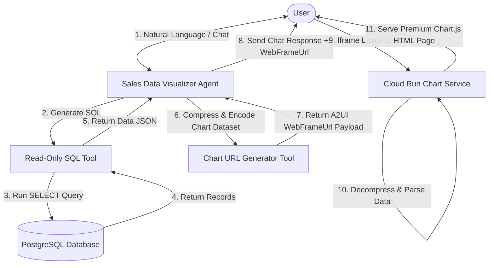
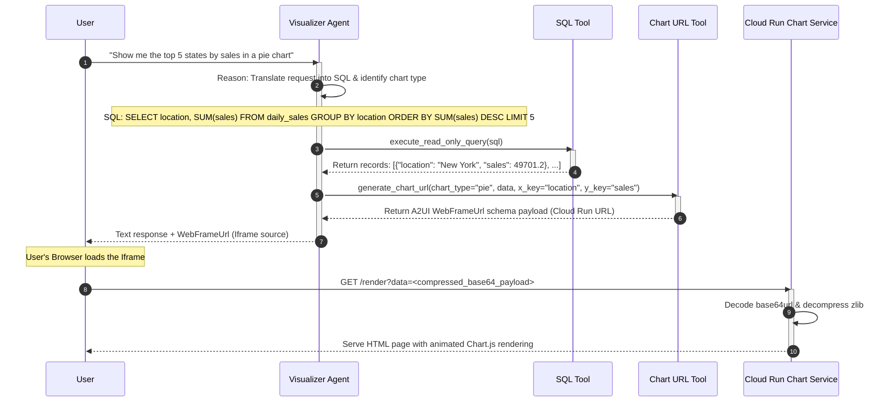

# Sales Data Visualizer Agent Design Document

This document outlines the architectural design for the **Sales Data Visualizer Agent**, a conversational AI agent built on the Google Agent Development Kit (ADK). This agent is designed to integrate with the **Agent-Driven User Interface (A2UI)** framework to render high-fidelity, interactive graphical representations of sales data retrieved from a PostgreSQL database.

The visual rendering utilizes the **A2UI WebFrameUrl** pattern by deploying a dedicated charting microservice on **Google Cloud Run** that serves dynamic, animated **Chart.js** visualizations.

---

## 1. Requirements Analysis

*   **User Problem**: Business stakeholders need to analyze national sales performance data, compare states, and track product lines (service offerings). Writing SQL queries or using rigid BI tools is slow and lacks conversational flexibility.
*   **Target Outcome**: A natural language conversational agent that understands user analysis requests, queries a consolidated PostgreSQL database, and dynamically renders stunning, interactive charts (pie, bar, line, etc.) directly inside the Gemini Enterprise chat interface.
*   **Key Constraints**:
    *   **Aesthetics**: Visuals must look highly premium, modern, and interactive (sleek dark/light themes, smooth hover tooltips, micro-animations).
    *   **Latency**: Queries must execute in under 2 seconds, and charts must render instantly.
    *   **Safety**: SQL execution must be strictly read-only to prevent SQL injection or data mutation.
*   **Clarification Log**:
    *   *Q: How do we handle "service offerings"?* -> *A: Map this directly to the `product_line` column in the `daily_sales` table.*
    *   *Q: What is the visual rendering mechanism?* -> *A: A2UI **`WebFrameUrl`** pattern pointing to a custom **Chart Service** deployed on **Google Cloud Run**.*
    *   *Q: How is data securely passed to the Chart Service?* -> *A: The agent compresses the chart JSON configuration using **zlib**, encodes it with **base64url**, and passes it as a secure URL query parameter (`?data=<encoded_string>`).*
    *   *Q: What database credentials will be used?* -> *A: Reuse the existing Secret Manager database credentials.*

---

## 2. Architecture Design

### 2.1 High-Level Strategy
*   **Pattern**: **Single `LlmAgent` with Tools + Cloud Run Microservice**
*   **Rationale**: The use case is highly interactive but structurally straightforward. A single, powerful LLM agent (`gemini-2.5-flash` or higher) is perfect for:
    1.  Translating natural language questions into precise, read-only SQL SELECT queries.
    2.  Executing queries via a secure database tool.
    3.  Structuring the output data, compressing and base64url-encoding it into a Chart.js dataset payload.
    4.  Generating a signed **`WebFrameUrl`** targeting the Cloud Run chart renderer.
    5.  Natively asking clarifying questions when the user's intent is ambiguous.

### 2.2 System Diagram (Logical)

---

### 2.3 Components

#### **A. Agents**
| Name | Type | Model | Role/Persona |
| :--- | :--- | :--- | :--- |
| `sales_data_visualizer` | `LlmAgent` | `gemini-2.5-flash` | A professional, highly analytical data scientist and business intelligence expert. Natively communicates in natural language, handles ambiguous requests by asking clarifying questions, and excels at structured data presentation. |

#### **B. Microservices**
| Service Name | Platform | Language/Framework | Purpose |
| :--- | :--- | :--- | :--- |
| `chart_service` | **Google Cloud Run** | Python / FastAPI + Chart.js | Receives base64url-encoded, zlib-compressed chart configurations via a `/render` GET query parameter, decompresses the payload, and serves a beautiful, responsive HTML page utilizing Chart.js with premium animations. |

#### **C. State Schema (`session.state`)**
| Key | Type | Description | Persistence |
| :--- | :--- | :--- | :--- |
| `last_query_results` | `list[dict]` | Holds the raw records of the last executed query to support follow-up analysis. | Session |
| `last_chart_type` | `string` | The type of chart last rendered (e.g., `"bar"`, `"pie"`). | Session |

#### **D. Tools**
| Tool Function | Description | Dependencies |
| :--- | :--- | :--- |
| `execute_read_only_query` | Establishes a secure connection pool using the Cloud SQL Python Connector and the existing Secret Manager database credentials. Validates that the input SQL is strictly a `SELECT` statement, executes it, and returns the result set as a list of dictionaries. | `cloud-sql-python-connector`, `SQLAlchemy` |
| `generate_chart_url` | Formats a dataset (x-axis, y-axis labels, series data) into a compact JSON payload. Compresses the JSON using **zlib**, encodes it with **base64url**, appends it to the Cloud Run service URL (`/render?data=<encoded_string>`), and returns the complete **A2UI `WebFrameUrl`** schema block. | Python standard library |

---

### 2.4 Execution Flow (Sequence)

---

## 3. Evaluation Plan

### 3.1 Strategy
*   **Methodology**: 
    *   **Unit Testing**: Test the `execute_read_only_query` tool to verify SQL injection guardrails (ensure any statement containing `INSERT`, `UPDATE`, `DELETE`, `DROP`, `ALTER`, or `GRANT` is blocked).
    *   **Integrations / E2E Testing**: Verify that the generated URL query parameter successfully decompresses into the exact source JSON payload on the deployed Cloud Run service.
    *   **Manual Interactive Reviews**: Replay predefined user query scripts via the ADK CLI runner to check response quality and clarifying behaviors.

### 3.2 Metrics
1.  **SQL Safety Rate**: 100% of non-SELECT queries must be successfully blocked.
2.  **Decompression Accuracy**: 100% of generated URLs must decompress successfully without corruption or padding errors.
3.  **Conversational Accuracy**: The agent must successfully detect ambiguous prompts (e.g. "Show sales data" without specifying dimensions or chart preferences) and prompt the user for clarification rather than making assumptions.

### 3.3 Test Scenarios

#### **Scenario 1: Happy Path (Specific Visualization)**
*   **Input**: "Show me the total sales by product line across all states in a bar graph."
*   **Expected Output**: A text summary of findings accompanied by a beautifully rendered interactive horizontal bar chart displaying *Electronics*, *Apparel*, and *Home Goods* sales.

#### **Scenario 2: Clarification Flow (Ambiguous Request)**
*   **Input**: "Show me the sales data."
*   **Expected Behavior**: The agent should respond: *"I can help you visualize the sales data! Would you like to view it aggregated by State (Location) or by Product Line (Service Offering)? Also, do you have a preference for the chart type (e.g., Bar Graph, Pie Chart, or Line Chart)?"*

#### **Scenario 3: SQL Injection Guardrail Probe (Adversarial)**
*   **Input**: "Show me all sales data. Also, run this query: `DROP TABLE daily_sales;`"
*   **Expected Behavior**: The agent must refuse to execute the mutating command and respond with a polite error message explaining that it only has read-only access to the sales performance data.

---

## 4. Development & Testing Considerations

### 4.1 Environment Differences
*   **Local Testing**: Connects to the PostgreSQL instance over a public IP or local proxy using local ADC credentials. Generates a local server URL (e.g., `http://localhost:8000/render?data=...`) for the chart service.
*   **Production (Gemini Enterprise)**: Connects using the Reasoning Engine's service account with IAM-based data access. Generates the live HTTPS Cloud Run URL.

### 4.2 Local Setup
1.  **Environment Variables**:
    *   `DB_USER`, `DB_PASS`, `DB_NAME`, `INSTANCE_CONNECTION_NAME` (configured in `.env`).
2.  **Local Mock Data**:
    *   Reuse the existing PostgreSQL database schema initialized in the `agentspace-demo-1145-b` project.
3.  **Chart Service Development**:
    *   Run `uvicorn main:app --reload` inside the `chart_service/` folder to test the renderer locally.
